# AI辅助测试点生成 - AR软件实现设计文档

## 1 需求重述

### 1.1 需求背景

在软件测试过程中，测试点的设计和生成是一项耗时且需要丰富经验的工作。传统的测试点生成依赖于测试工程师手工分析需求文档、梳理功能点并设计测试用例。这种方式存在以下问题：
- 测试点生成效率低，人工成本高
- 测试覆盖率依赖个人经验，容易遗漏边界场景
- 重复性工作多，测试工程师价值发挥不充分

随着AI技术的发展，特别是大语言模型在需求理解和测试场景生成方面展现出的能力，为测试点自动生成提供了新的解决方案。本需求旨在通过AI能力辅助测试工程师快速、准确地生成测试点，提升测试效率和质量。

### 1.2 需求功能介绍

本需求在TSE（测试服务引擎）作业流中引入AI辅助测试点生成功能，通过附屏方式实现人机交互，支持以下核心能力：

1. **需求管理**：展示当前任务涉及的所有需求列表，支持用户选择目标需求
2. **Workflow配置**：支持用户选择预配置的测试点生成workflow
3. **智能生成**：基于选定的workflow和需求信息，调用AI模型生成测试点
4. **结果展示**：流式展示AI生成过程和结构化结果
5. **交互优化**：支持用户批量接收测试点、补充信息重新生成
6. **数据集成**：将AI生成的测试点回填至作业系统并上报运营平台

## 2 功能实现分析

### 2.1 总体架构设计

#### 2.1.1 系统架构图

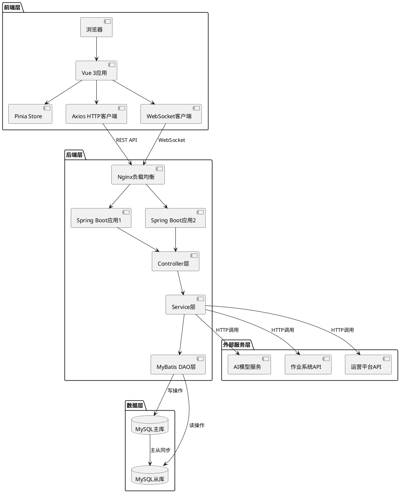

#### 2.1.2 前后端交互流程

**整体数据流**：
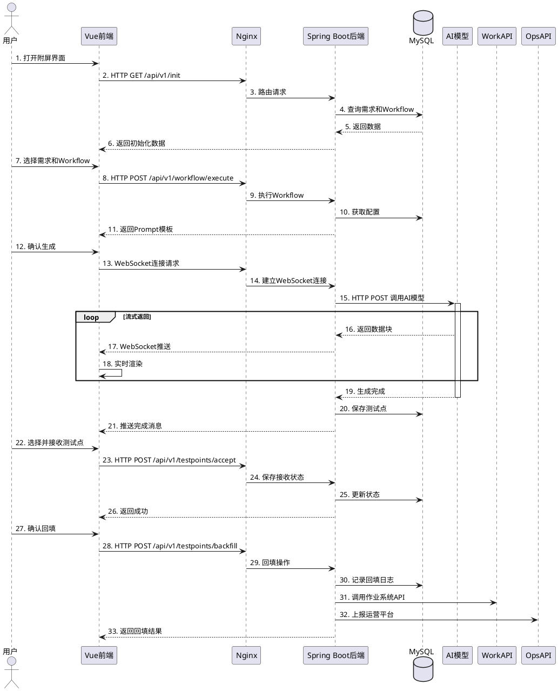

#### 2.1.3 技术栈对比

| 层次 | 前端技术栈 | 后端技术栈 |
|-----|----------|----------|
| 开发语言 | TypeScript | Java 8 |
| 框架 | Vue 3 | Spring Boot 2.7.x |
| 状态管理 | Pinia | - |
| HTTP通信 | Axios | RestTemplate / OkHttp |
| WebSocket | 原生WebSocket API | Spring WebSocket |
| 数据持久化 | LocalStorage / SessionStorage | MyBatis + MySQL |
| 构建工具 | Vite | Maven |
| 代码规范 | ESLint + Prettier | Checkstyle |
| 单元测试 | Vitest + Vue Test Utils | JUnit + Mockito |

#### 2.1.4 接口设计规范

**RESTful API规范**：
- 使用标准HTTP方法：GET（查询）、POST（创建）、PUT（更新）、DELETE（删除）
- URL路径使用名词复数形式：`/api/v1/requirements`、`/api/v1/workflows`
- 使用HTTP状态码：200（成功）、400（请求错误）、401（未授权）、500（服务器错误）
- 请求和响应统一使用JSON格式
- 统一响应结构：
```typescript
interface ApiResponse<T> {
    code: number;        // 业务状态码
    message: string;     // 提示信息
    data: T;            // 业务数据
    timestamp: number;   // 时间戳
    traceId: string;    // 追踪ID
}
```

**WebSocket消息规范**：
```typescript
interface WebSocketMessage {
    type: 'chunk' | 'complete' | 'error';  // 消息类型
    sessionId: string;                      // 会话ID
    data: any;                              // 消息数据
    timestamp: number;                      // 时间戳
}
```

### 2.2 功能点清单

| 功能点ID | 功能点名称 | 优先级 | 说明 |
|---------|----------|-------|------|
| F001 | 附屏界面框架 | P0 | 提供AI辅助测试点生成的交互界面框架 |
| F002 | 需求列表展示与选择 | P0 | 展示当前TS涉及的需求并支持切换选择 |
| F003 | Workflow配置管理 | P0 | 展示和选择预配置的测试点生成workflow |
| F004 | Workflow执行引擎 | P0 | 调用workflow并获取prompt模板和参数 |
| F005 | Prompt模板处理 | P0 | 拼装替换prompt模板中的占位参数 |
| F006 | AI模型调用服务 | P0 | 调用配置的AI模型生成测试点 |
| F007 | 流式结果展示 | P1 | 实时展示AI生成过程和结构化结果 |
| F008 | 测试点接收与编辑 | P0 | 支持批量选择和接收AI生成的测试点 |
| F009 | 重新生成机制 | P1 | 支持补充信息后重新生成测试点 |
| F010 | 数据回填与上报 | P0 | 将测试点回填至作业系统并上报运营平台 |

### 2.3 功能点1：附屏界面框架

#### 2.3.1 前端设计

**功能说明**：
参照TestMate交互方式，实现附屏界面框架，作为AI辅助测试点生成的主界面容器。

**界面结构**：
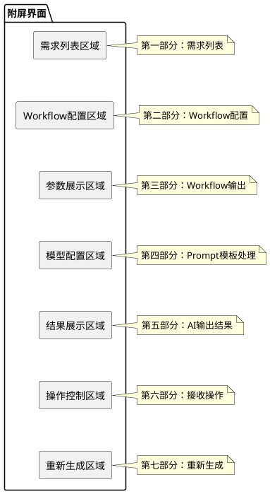

**前端技术栈**：
- 前端框架：Vue 3 + TypeScript
- UI组件库：Element Plus
- 状态管理：Pinia
- HTTP客户端：Axios
- WebSocket客户端：原生WebSocket API + 重连机制
- 构建工具：Vite
- 代码规范：ESLint + Prettier

**前端组件结构**：
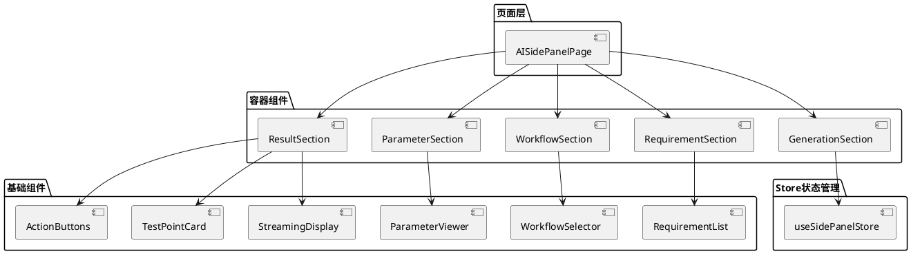

**前端状态管理**：
```typescript
// Pinia Store定义
interface SidePanelState {
    // 基础信息
    panelId: string;
    tsId: string;
    userId: string;
    
    // 需求相关
    requirements: Requirement[];
    selectedRequirement: Requirement | null;
    
    // Workflow相关
    workflows: WorkflowInfo[];
    selectedWorkflow: WorkflowInfo | null;
    workflowResult: WorkflowResult | null;
    
    // 生成相关
    generationStatus: 'idle' | 'generating' | 'completed' | 'error';
    testPoints: TestPoint[];
    selectedTestPointIds: Set<string>;
    
    // WebSocket连接
    wsConnected: boolean;
    wsError: string | null;
}
```

**前端路由配置**：
```typescript
// 路由定义
const routes = [
    {
        path: '/tse/ai-testpoint-generation',
        name: 'AITestPointGeneration',
        component: () => import('@/views/AISidePanelPage.vue'),
        meta: {
            title: 'AI辅助测试点生成',
            requiresAuth: true
        }
    }
];
```

#### 2.3.2 后端设计

**后端技术栈**：
- 开发语言：Java 8
- 框架：Spring Boot 2.7.x
- Web框架：Spring MVC + Spring WebSocket
- ORM框架：MyBatis 3.5.x
- 数据库：MySQL 5.7+
- 连接池：HikariCP
- HTTP客户端：OkHttp / RestTemplate
- JSON处理：Jackson

**后端服务架构**：
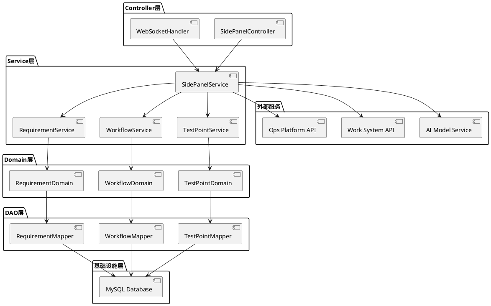

**后端接口定义**：
```typescript
// 附屏初始化接口
interface SidePanelInitRequest {
    taskId: string;        // 任务ID
    tsId: string;          // 测试单ID
    userId: string;        // 用户ID
}

interface SidePanelInitResponse {
    panelId: string;       // 附屏实例ID
    requirements: Requirement[];  // 需求列表
    workflows: Workflow[];        // 可用workflow列表
}
```

**后端数据库表设计**：
```sql
-- 附屏会话表
CREATE TABLE t_sidepanel_session (
    id VARCHAR(64) PRIMARY KEY COMMENT '会话ID',
    ts_id VARCHAR(64) NOT NULL COMMENT '测试单ID',
    user_id VARCHAR(64) NOT NULL COMMENT '用户ID',
    session_status VARCHAR(32) COMMENT '会话状态：active/closed',
    create_time TIMESTAMP DEFAULT CURRENT_TIMESTAMP,
    update_time TIMESTAMP DEFAULT CURRENT_TIMESTAMP ON UPDATE CURRENT_TIMESTAMP,
    expire_time TIMESTAMP COMMENT '过期时间',
    INDEX idx_ts_id (ts_id),
    INDEX idx_user_id (user_id)
) COMMENT='附屏会话表';
```

### 2.4 功能点2：需求列表展示与选择

#### 2.4.1 前端设计

**功能说明**：
展示当前TS（测试单）涉及的所有需求列表，支持用户切换选择不同需求进行测试点生成。

**前端组件设计**：
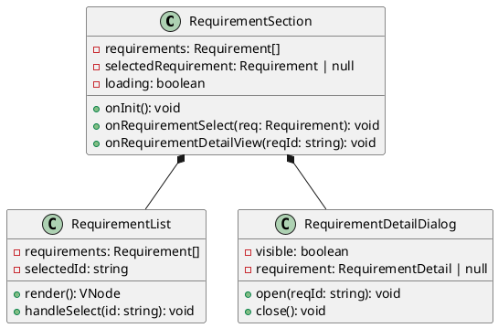

**前端交互流程**：
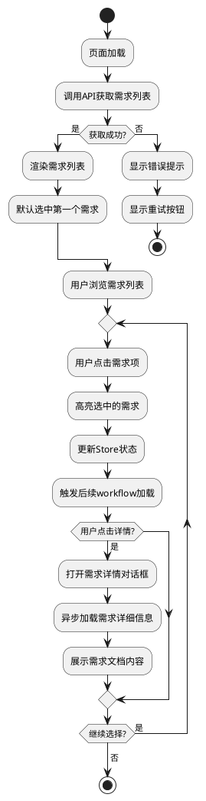

**前端状态管理**：
```typescript
// 需求相关State
interface RequirementState {
    requirements: Requirement[];
    selectedRequirement: Requirement | null;
    requirementDetail: RequirementDetail | null;
    loading: boolean;
    error: string | null;
}

// 需求相关Actions
const useRequirementStore = defineStore('requirement', {
    state: (): RequirementState => ({
        requirements: [],
        selectedRequirement: null,
        requirementDetail: null,
        loading: false,
        error: null
    }),
    
    actions: {
        async fetchRequirements(tsId: string) {
            this.loading = true;
            try {
                const response = await api.getRequirements({ tsId });
                this.requirements = response.requirements;
                if (this.requirements.length > 0) {
                    this.selectedRequirement = this.requirements[0];
                }
            } catch (error) {
                this.error = error.message;
            } finally {
                this.loading = false;
            }
        },
        
        selectRequirement(requirement: Requirement) {
            this.selectedRequirement = requirement;
        },
        
        async fetchRequirementDetail(reqId: string) {
            const response = await api.getRequirementDetail({ reqId });
            this.requirementDetail = response;
        }
    }
});
```

**前端API调用**：
```typescript
// API Service层
export const requirementApi = {
    getRequirements(params: GetRequirementsRequest): Promise<GetRequirementsResponse> {
        return axios.get('/api/v1/requirements', { params });
    },
    
    getRequirementDetail(params: GetRequirementDetailRequest): Promise<RequirementDetail> {
        return axios.get(`/api/v1/requirements/${params.reqId}`);
    }
};
```

#### 2.4.2 后端设计

**后端服务架构**：
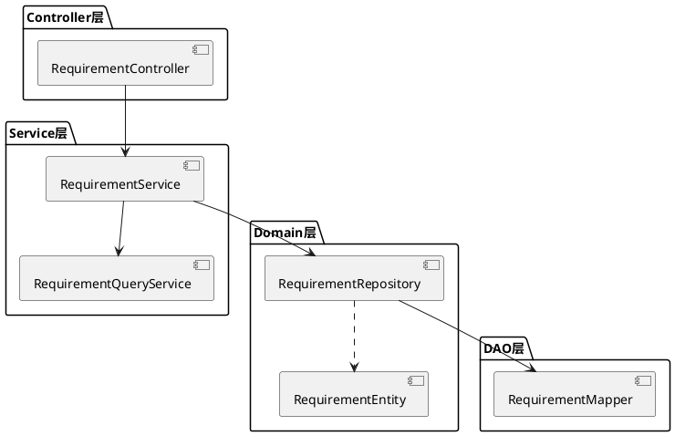

**后端数据库表设计**：
```sql
-- 需求信息表
CREATE TABLE t_requirement (
    id VARCHAR(64) PRIMARY KEY COMMENT '需求ID',
    ts_id VARCHAR(64) NOT NULL COMMENT '测试单ID',
    req_name VARCHAR(256) NOT NULL COMMENT '需求名称',
    req_desc TEXT COMMENT '需求描述',
    req_doc_url VARCHAR(512) COMMENT '需求文档URL',
    req_doc_content LONGTEXT COMMENT '需求文档内容',
    test_scope TEXT COMMENT '测试范围',
    status VARCHAR(32) COMMENT '需求状态',
    create_time TIMESTAMP DEFAULT CURRENT_TIMESTAMP,
    update_time TIMESTAMP DEFAULT CURRENT_TIMESTAMP ON UPDATE CURRENT_TIMESTAMP,
    INDEX idx_ts_id (ts_id),
    INDEX idx_status (status)
) COMMENT='需求信息表';
```

**后端接口实现**：
```java
@RestController
@RequestMapping("/api/v1/requirements")
public class RequirementController {
    
    @Autowired
    private RequirementService requirementService;
    
    @GetMapping
    public ResponseEntity<GetRequirementsResponse> getRequirements(
            @RequestParam String tsId) {
        List<Requirement> requirements = requirementService.getRequirementsByTsId(tsId);
        return ResponseEntity.ok(new GetRequirementsResponse(requirements));
    }
    
    @GetMapping("/{reqId}")
    public ResponseEntity<RequirementDetail> getRequirementDetail(
            @PathVariable String reqId) {
        RequirementDetail detail = requirementService.getRequirementDetail(reqId);
        return ResponseEntity.ok(detail);
    }
}

@Service
public class RequirementService {
    
    @Autowired
    private RequirementRepository requirementRepository;
    
    @Autowired
    private RequirementQueryService queryService;
    
    public List<Requirement> getRequirementsByTsId(String tsId) {
        return requirementRepository.findByTsId(tsId);
    }
    
    public RequirementDetail getRequirementDetail(String reqId) {
        RequirementEntity entity = requirementRepository.findById(reqId)
            .orElseThrow(() -> new NotFoundException("需求不存在"));
        
        return queryService.buildRequirementDetail(entity);
    }
}
```

**后端接口定义**：
```typescript
// 获取需求列表
interface GetRequirementsRequest {
    tsId: string;
}

interface Requirement {
    id: string;
    name: string;
    description: string;
    docUrl: string;
    status: string;
}

interface GetRequirementsResponse {
    requirements: Requirement[];
}

// 获取需求详情
interface GetRequirementDetailRequest {
    reqId: string;
}

interface RequirementDetail extends Requirement {
    fullDescription: string;
    attachments: string[];
    testScope: string;
    docContent: string;
}
```

### 2.5 功能点3：Workflow配置管理

#### 2.5.1 前端设计

**功能说明**：
展示当前可用的测试点生成workflow（已在配置中心预先配置），支持用户切换选择不同的workflow。

**前端组件设计**：
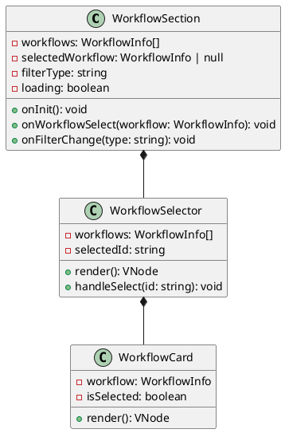

**前端状态管理**：
```typescript
// Workflow相关State
interface WorkflowState {
    workflows: WorkflowInfo[];
    selectedWorkflow: WorkflowInfo | null;
    filterType: string;
    loading: boolean;
    error: string | null;
}

// Workflow相关Actions
const useWorkflowStore = defineStore('workflow', {
    state: (): WorkflowState => ({
        workflows: [],
        selectedWorkflow: null,
        filterType: 'all',
        loading: false,
        error: null
    }),
    
    actions: {
        async fetchWorkflows(workflowType?: string) {
            this.loading = true;
            try {
                const response = await workflowApi.getWorkflows({ workflowType });
                this.workflows = response.workflows;
            } catch (error) {
                this.error = error.message;
            } finally {
                this.loading = false;
            }
        },
        
        selectWorkflow(workflow: WorkflowInfo) {
            this.selectedWorkflow = workflow;
        }
    },
    
    getters: {
        filteredWorkflows(): WorkflowInfo[] {
            if (this.filterType === 'all') {
                return this.workflows;
            }
            return this.workflows.filter(w => w.type === this.filterType);
        }
    }
});
```

**前端API调用**：
```typescript
// Workflow API Service
export const workflowApi = {
    getWorkflows(params: GetWorkflowsRequest): Promise<GetWorkflowsResponse> {
        return axios.get('/api/v1/workflows', { params });
    }
};
```

#### 2.5.2 后端设计

**后端服务架构**：
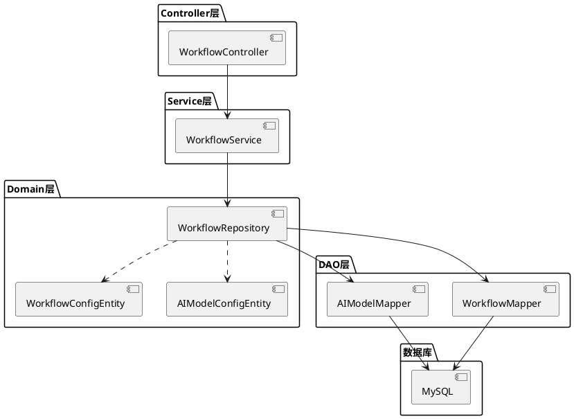

**后端数据库表设计**：
```sql
-- Workflow配置表
CREATE TABLE t_workflow_config (
    id VARCHAR(64) PRIMARY KEY COMMENT 'Workflow ID',
    workflow_name VARCHAR(128) NOT NULL COMMENT 'Workflow名称',
    workflow_desc TEXT COMMENT 'Workflow描述',
    workflow_type VARCHAR(32) COMMENT 'Workflow类型：功能测试、性能测试、安全测试等',
    workflow_url VARCHAR(512) COMMENT 'Workflow调用URL',
    prompt_template TEXT COMMENT 'Prompt模板',
    template_params JSON COMMENT '模板参数定义',
    model_id VARCHAR(64) COMMENT '关联的模型ID',
    is_active TINYINT DEFAULT 1 COMMENT '是否启用',
    create_time TIMESTAMP DEFAULT CURRENT_TIMESTAMP,
    update_time TIMESTAMP DEFAULT CURRENT_TIMESTAMP ON UPDATE CURRENT_TIMESTAMP,
    INDEX idx_type (workflow_type),
    INDEX idx_active (is_active)
) COMMENT='Workflow配置表';

-- 模型配置表
CREATE TABLE t_ai_model_config (
    id VARCHAR(64) PRIMARY KEY COMMENT '模型ID',
    model_name VARCHAR(128) NOT NULL COMMENT '模型名称',
    model_provider VARCHAR(64) COMMENT '模型提供商',
    model_version VARCHAR(32) COMMENT '模型版本',
    api_endpoint VARCHAR(512) COMMENT 'API端点',
    api_key_encrypted VARCHAR(256) COMMENT '加密的API密钥',
    max_tokens INT COMMENT '最大token数',
    temperature DECIMAL(3,2) COMMENT '温度参数',
    is_active TINYINT DEFAULT 1 COMMENT '是否启用',
    create_time TIMESTAMP DEFAULT CURRENT_TIMESTAMP,
    update_time TIMESTAMP DEFAULT CURRENT_TIMESTAMP ON UPDATE CURRENT_TIMESTAMP,
    INDEX idx_active (is_active)
) COMMENT='AI模型配置表';
```

**后端领域模型**：
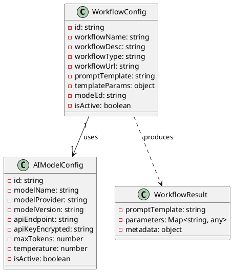

**后端接口实现**：
```java
@RestController
@RequestMapping("/api/v1/workflows")
public class WorkflowController {
    
    @Autowired
    private WorkflowService workflowService;
    
    @GetMapping
    public ResponseEntity<GetWorkflowsResponse> getWorkflows(
            @RequestParam(required = false) String workflowType) {
        List<WorkflowInfo> workflows = workflowService.getActiveWorkflows(workflowType);
        return ResponseEntity.ok(new GetWorkflowsResponse(workflows));
    }
}

@Service
public class WorkflowService {
    
    @Autowired
    private WorkflowRepository workflowRepository;
    
    @Autowired
    private AIModelRepository aiModelRepository;
    
    public List<WorkflowInfo> getActiveWorkflows(String workflowType) {
        // 从数据库查询
        List<WorkflowConfigEntity> entities;
        if (workflowType != null && !workflowType.isEmpty()) {
            entities = workflowRepository.findByTypeAndActive(workflowType, true);
        } else {
            entities = workflowRepository.findByActive(true);
        }
        
        // 转换为VO并关联模型信息
        List<WorkflowInfo> workflows = new ArrayList<>();
        for (WorkflowConfigEntity entity : entities) {
            WorkflowInfo info = convertToWorkflowInfo(entity);
            workflows.add(info);
        }
        
        return workflows;
    }
    
    private WorkflowInfo convertToWorkflowInfo(WorkflowConfigEntity entity) {
        WorkflowInfo info = new WorkflowInfo();
        info.setId(entity.getId());
        info.setName(entity.getWorkflowName());
        info.setDescription(entity.getWorkflowDesc());
        info.setType(entity.getWorkflowType());
        info.setModelId(entity.getModelId());
        
        // 查询关联的模型名称
        AIModelConfigEntity model = aiModelRepository.findById(entity.getModelId());
        if (model != null) {
            info.setModelName(model.getModelName());
        }
        
        return info;
    }
}
```

**后端接口定义**：
```typescript
// 获取Workflow列表
interface GetWorkflowsRequest {
    workflowType?: string;  // 可选：按类型筛选
}

interface WorkflowInfo {
    id: string;
    name: string;
    description: string;
    type: string;
    modelId: string;
    modelName: string;
}

interface GetWorkflowsResponse {
    workflows: WorkflowInfo[];
}
```

### 2.6 功能点4：Workflow执行引擎

#### 详细描述

**功能说明**：
用户选择具体workflow后，后台服务传递参数调用workflow，获取并条目化展示workflow返回的内容，包括prompt模板和模板中涉及的占位参数变量。

**执行流程图**：
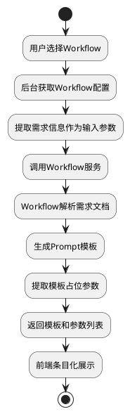

**序列图**：
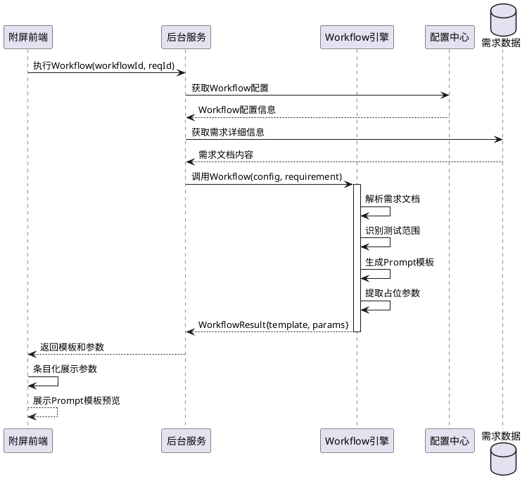

**数据实体关系图**：
```plantuml
@erdiagram
entity "Requirement" {
    *id : VARCHAR(64)
    --
    ts_id : VARCHAR(64)
    req_name : VARCHAR(256)
    req_desc : TEXT
    req_doc_url : VARCHAR(512)
}

entity "WorkflowConfig" {
    *id : VARCHAR(64)
    --
    workflow_name : VARCHAR(128)
    prompt_template : TEXT
    template_params : JSON
    model_id : VARCHAR(64)
}

entity "WorkflowExecution" {
    *id : VARCHAR(64)
    --
    workflow_id : VARCHAR(64)
    req_id : VARCHAR(64)
    input_params : JSON
    output_template : TEXT
    output_params : JSON
    execution_time : TIMESTAMP
}

Requirement ||--o{ WorkflowExecution : "triggers"
WorkflowConfig ||--o{ WorkflowExecution : "executes"

@enduml
```

**接口定义**：
```typescript
// 执行Workflow
interface ExecuteWorkflowRequest {
    workflowId: string;
    reqId: string;
    additionalParams?: Record<string, any>;
}

interface TemplateParameter {
    key: string;
    name: string;
    type: string;
    value: any;
    description: string;
}

interface ExecuteWorkflowResponse {
    executionId: string;
    promptTemplate: string;
    parameters: TemplateParameter[];
    metadata: {
        extractedInfo: string[];
        testScope: string[];
    };
}
```

### 2.7 功能点5：Prompt模板处理

#### 详细描述

**功能说明**：
拼装替换prompt模板中的占位参数，准备调用AI模型。

**算法流程图**：
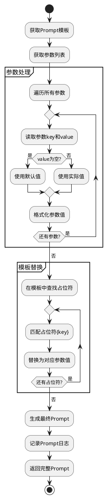

**类图**：
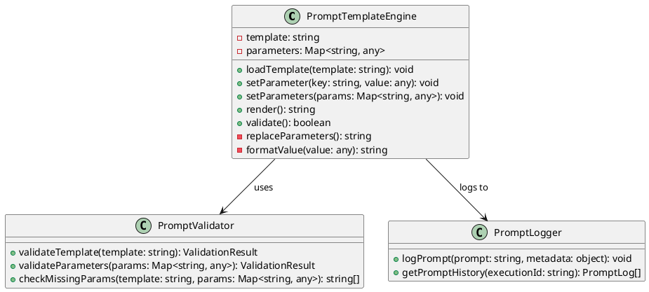

**接口定义**：
```typescript
// 处理Prompt模板
interface ProcessPromptRequest {
    executionId: string;
    template: string;
    parameters: Record<string, any>;
}

interface ProcessPromptResponse {
    finalPrompt: string;
    tokensCount: number;
    validationResult: {
        isValid: boolean;
        warnings: string[];
    };
}
```

### 2.8 功能点6：AI模型调用服务

#### 详细描述

**功能说明**：
使用处理好的prompt调用预配置的AI模型（模型ID已在后台数据库配置），生成测试点。

**序列图**：
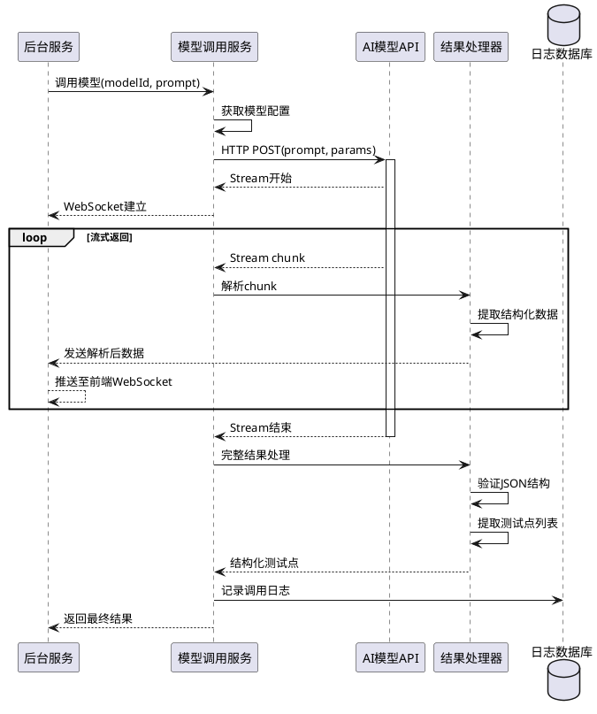

**数据库表设计**：
```sql
-- 模型调用日志表
CREATE TABLE t_model_invocation_log (
    id VARCHAR(64) PRIMARY KEY COMMENT '日志ID',
    execution_id VARCHAR(64) COMMENT '执行ID',
    model_id VARCHAR(64) COMMENT '模型ID',
    prompt TEXT COMMENT '输入Prompt',
    prompt_tokens INT COMMENT 'Prompt token数',
    completion_tokens INT COMMENT '生成token数',
    total_tokens INT COMMENT '总token数',
    response_text TEXT COMMENT '模型返回内容',
    response_time_ms INT COMMENT '响应时间(毫秒)',
    status VARCHAR(32) COMMENT '调用状态：success/failed',
    error_message TEXT COMMENT '错误信息',
    create_time TIMESTAMP DEFAULT CURRENT_TIMESTAMP,
    INDEX idx_execution_id (execution_id),
    INDEX idx_model_id (model_id)
) COMMENT='模型调用日志表';
```

**接口定义**：
```typescript
// 调用AI模型
interface CallAIModelRequest {
    executionId: string;
    modelId: string;
    prompt: string;
    streamMode: boolean;  // 是否流式返回
    temperature?: number;
    maxTokens?: number;
}

interface TestPoint {
    id: string;
    category: string;      // 测试分类
    scenario: string;      // 测试场景
    description: string;   // 测试描述
    priority: string;      // 优先级
    precondition: string;  // 前置条件
    steps: string[];       // 测试步骤
    expectedResult: string; // 期望结果
}

interface CallAIModelResponse {
    executionId: string;
    testPoints: TestPoint[];
    metadata: {
        totalCount: number;
        tokensUsed: number;
        generationTime: number;
    };
}

// WebSocket消息格式
interface StreamMessage {
    type: 'chunk' | 'complete' | 'error';
    data: {
        content?: string;
        testPoint?: TestPoint;
        error?: string;
    };
}
```

### 2.9 功能点7：流式结果展示

#### 详细描述

**功能说明**：
模型输出过程内容流式在页面呈现，输出的JSON结构化数据在页面条目化呈现。

**前端组件结构**：
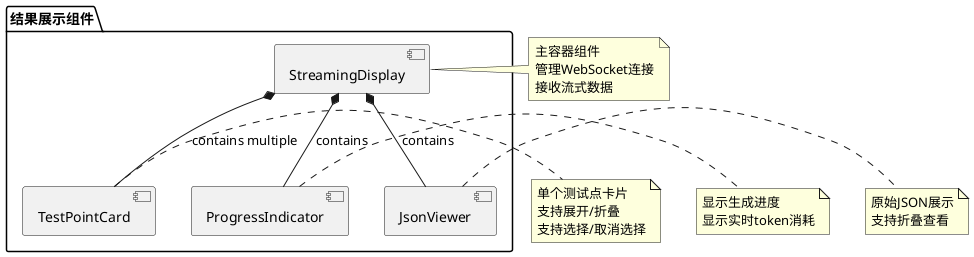

**状态机图**：
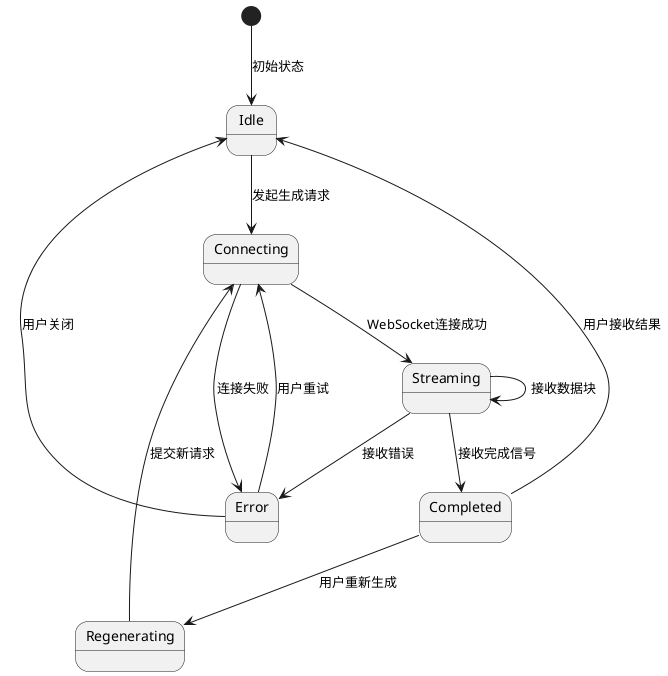

**接口定义**：
```typescript
// 前端状态管理
interface StreamingState {
    status: 'idle' | 'connecting' | 'streaming' | 'completed' | 'error';
    currentChunk: string;
    testPoints: TestPoint[];
    selectedIds: string[];
    metadata: {
        startTime: number;
        endTime?: number;
        totalTokens: number;
        pointsGenerated: number;
    };
    error?: string;
}

// WebSocket管理器
class WebSocketManager {
    private ws: WebSocket;
    private reconnectAttempts: number;
    
    public connect(executionId: string): Promise<void>;
    public disconnect(): void;
    public onMessage(callback: (msg: StreamMessage) => void): void;
    public onError(callback: (error: Error) => void): void;
    public onClose(callback: () => void): void;
}
```

### 2.10 功能点8：测试点接收与编辑

#### 详细描述

**功能说明**：
页面提供"接受"按钮，用户可批量选择AI生成的测试点条目并接收。

**交互流程图**：
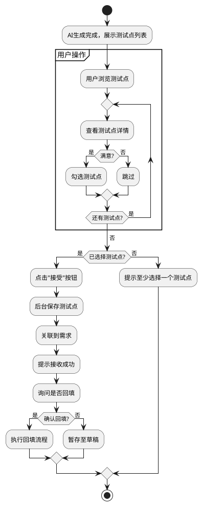

**数据库表设计**：
```sql
-- AI生成测试点表
CREATE TABLE t_ai_generated_testpoint (
    id VARCHAR(64) PRIMARY KEY COMMENT '测试点ID',
    execution_id VARCHAR(64) COMMENT '执行ID',
    req_id VARCHAR(64) COMMENT '需求ID',
    category VARCHAR(64) COMMENT '测试分类',
    scenario VARCHAR(256) COMMENT '测试场景',
    description TEXT COMMENT '测试描述',
    priority VARCHAR(16) COMMENT '优先级',
    precondition TEXT COMMENT '前置条件',
    test_steps JSON COMMENT '测试步骤',
    expected_result TEXT COMMENT '期望结果',
    is_accepted TINYINT DEFAULT 0 COMMENT '是否已接收',
    accepted_by VARCHAR(64) COMMENT '接收人',
    accepted_time TIMESTAMP COMMENT '接收时间',
    is_filled TINYINT DEFAULT 0 COMMENT '是否已回填',
    filled_time TIMESTAMP COMMENT '回填时间',
    create_time TIMESTAMP DEFAULT CURRENT_TIMESTAMP,
    INDEX idx_execution_id (execution_id),
    INDEX idx_req_id (req_id)
) COMMENT='AI生成测试点表';
```

**接口定义**：
```typescript
// 接收测试点
interface AcceptTestPointsRequest {
    executionId: string;
    testPointIds: string[];
    userId: string;
}

interface AcceptTestPointsResponse {
    acceptedCount: number;
    acceptedIds: string[];
    failedIds: string[];
    errors: Record<string, string>;
}

// 编辑测试点
interface UpdateTestPointRequest {
    testPointId: string;
    updates: Partial<TestPoint>;
}

interface UpdateTestPointResponse {
    success: boolean;
    updatedTestPoint: TestPoint;
}
```

### 2.11 功能点9：重新生成机制

#### 详细描述

**功能说明**：
若AI生成的测试点不符合预期，用户可以在输入框中补充信息并重新生成。

**交互流程**：
```plantuml
@startuml
actor 用户
participant "附屏界面" as UI
participant "后台服务" as Backend
participant "AI模型" as AI

用户 -> UI: 查看生成的测试点
用户 -> UI: 不满意，在输入框补充信息

note over 用户, UI
  示例补充信息：
  "请增加边界值测试场景"
  "请关注并发场景"
  "请增加异常处理测试"
end note

用户 -> UI: 点击"重新生成"按钮
UI -> UI: 保存历史生成记录
UI -> Backend: 重新生成请求(原prompt + 补充信息)

Backend -> Backend: 合并prompt
Backend -> Backend: prompt = 原始prompt + "\n\n用户反馈：" + 补充信息

Backend -> AI: 调用模型(新prompt)
AI --> Backend: 流式返回结果
Backend --> UI: WebSocket推送

UI --> 用户: 展示新的测试点

用户 -> UI: 对比新旧结果
用户 -> UI: 选择满意的测试点

@enduml
```

**算法流程**：
```plantuml
@startuml
start

:用户输入补充信息;

:获取上次生成的执行记录;

:提取上次的prompt;

:构建反馈上下文;
note right
  包含：
  - 原始prompt
  - 上次生成的测试点
  - 用户的补充要求
end note

:拼接新prompt;

partition "Prompt优化" {
    :添加上下文标记;
    :添加改进指令;
    :添加用户补充信息;
}

:调用AI模型;

:接收并展示新结果;

:保存生成历史;
note right
  支持用户查看多次
  生成的历史记录
end note

stop

@enduml
```

**数据库表设计**：
```sql
-- 重新生成历史表
CREATE TABLE t_regeneration_history (
    id VARCHAR(64) PRIMARY KEY COMMENT '历史ID',
    execution_id VARCHAR(64) COMMENT '执行ID',
    iteration INT COMMENT '迭代次数',
    feedback_text TEXT COMMENT '用户反馈',
    new_prompt TEXT COMMENT '新的Prompt',
    generated_count INT COMMENT '生成测试点数量',
    create_time TIMESTAMP DEFAULT CURRENT_TIMESTAMP,
    INDEX idx_execution_id (execution_id)
) COMMENT='重新生成历史表';
```

**接口定义**：
```typescript
// 重新生成
interface RegenerateTestPointsRequest {
    executionId: string;
    feedbackText: string;
    keepPreviousResults: boolean;  // 是否保留之前的结果
}

interface RegenerateTestPointsResponse {
    newExecutionId: string;
    iteration: number;
    streamUrl: string;  // WebSocket URL
}

// 查看历史
interface GetGenerationHistoryRequest {
    executionId: string;
}

interface GenerationHistoryItem {
    iteration: number;
    feedbackText: string;
    generatedCount: number;
    timestamp: string;
}

interface GetGenerationHistoryResponse {
    history: GenerationHistoryItem[];
}
```

### 2.12 功能点10：数据回填与上报

#### 详细描述

**功能说明**：
用户接收AI生成的测试点后，将数据回填至原作业系统，并上报至公司运营平台。

**序列图**：
```plantuml
@startuml
actor 用户
participant "附屏界面" as UI
participant "后台服务" as Backend
participant "作业系统API" as WorkSystem
participant "运营平台API" as OpsPlatform
database "本地数据库" as LocalDB

用户 -> UI: 点击"确认回填"
UI -> Backend: 发起回填请求(testPointIds)

Backend -> LocalDB: 查询测试点详情
LocalDB --> Backend: 测试点数据

Backend -> Backend: 转换为作业系统格式

Backend -> WorkSystem: 批量创建测试用例
activate WorkSystem
WorkSystem -> WorkSystem: 验证数据
WorkSystem -> WorkSystem: 保存测试用例
WorkSystem --> Backend: 返回用例ID列表
deactivate WorkSystem

Backend -> LocalDB: 更新回填状态

Backend -> Backend: 转换为运营平台格式

Backend -> OpsPlatform: 上报测试点数据
activate OpsPlatform
OpsPlatform -> OpsPlatform: 接收数据
OpsPlatform -> OpsPlatform: 统计分析
OpsPlatform --> Backend: 上报成功
deactivate OpsPlatform

Backend -> LocalDB: 更新上报状态

Backend --> UI: 回填完成
UI --> 用户: 显示回填结果

@enduml
```

**数据转换流程**：
```plantuml
@startuml
start

:获取接收的测试点列表;

partition "数据转换-作业系统" {
    :遍历测试点;
    
    repeat
        :提取测试点字段;
        :映射到作业系统字段;
        note right
          mapping:
          scenario -> test_case_name
          description -> test_description
          steps -> test_steps
          expectedResult -> expected_output
        end note
        :添加元数据（生成方式=AI）;
        :构建作业系统格式;
    repeat while (还有测试点?) is (是)
    ->否;
}

:批量调用作业系统API;

if (回填成功?) then (是)
    partition "数据转换-运营平台" {
        :提取统计信息;
        :构建上报数据;
        note right
          包含：
          - AI生成测试点数量
          - 用户接收数量
          - 生成耗时
          - 涉及需求信息
        end note
    }
    
    :调用运营平台API;
    
    if (上报成功?) then (是)
        :更新所有状态为完成;
        :记录操作日志;
        :返回成功;
    else (否)
        :记录上报失败;
        :返回部分成功;
    endif
else (否)
    :回滚本地状态;
    :返回失败;
endif

stop

@enduml
```

**数据库表设计**：
```sql
-- 回填记录表
CREATE TABLE t_backfill_record (
    id VARCHAR(64) PRIMARY KEY COMMENT '回填记录ID',
    execution_id VARCHAR(64) COMMENT '执行ID',
    testpoint_ids JSON COMMENT '测试点ID列表',
    work_system_ids JSON COMMENT '作业系统用例ID列表',
    backfill_status VARCHAR(32) COMMENT '回填状态',
    backfill_time TIMESTAMP COMMENT '回填时间',
    report_status VARCHAR(32) COMMENT '上报状态',
    report_time TIMESTAMP COMMENT '上报时间',
    error_message TEXT COMMENT '错误信息',
    create_time TIMESTAMP DEFAULT CURRENT_TIMESTAMP,
    INDEX idx_execution_id (execution_id)
) COMMENT='回填记录表';
```

**接口定义**：
```typescript
// 回填到作业系统
interface BackfillToWorkSystemRequest {
    testPointIds: string[];
    targetProjectId: string;
    targetModuleId: string;
}

interface WorkSystemTestCase {
    caseId: string;
    caseName: string;
    status: string;
}

interface BackfillToWorkSystemResponse {
    successCount: number;
    failedCount: number;
    workSystemCases: WorkSystemTestCase[];
    errors: Array<{testPointId: string, error: string}>;
}

// 上报到运营平台
interface ReportToOpsPlatformRequest {
    executionId: string;
    backfillRecordId: string;
}

interface ReportToOpsPlatformResponse {
    reportId: string;
    reportTime: string;
    status: string;
}
```

## 3 DFX分析

### 3.1 可靠性（Reliability）

**策略**：
1. **重试机制**：AI模型调用失败时，自动重试3次，重试间隔采用指数退避策略（1s、2s、4s）
2. **降级方案**：当AI服务不可用时，允许用户手工输入测试点
3. **数据持久化**：每次生成的中间结果都持久化到数据库，防止数据丢失
4. **事务保障**：
   - 使用Spring @Transactional管理本地事务
   - 回填操作记录详细日志，支持手工补偿
   - 关键操作支持幂等性设计

**监控指标**：
- AI服务可用率 > 99.5%
- 单次请求成功率 > 95%
- 数据回填成功率 > 98%

### 3.2 性能（Performance）

**性能目标**：
| 操作 | 响应时间 | 并发支持 |
|------|---------|---------|
| 需求列表加载 | < 1s | 1000 QPS |
| Workflow执行 | < 3s | 500 QPS |
| AI模型调用（首字节） | < 2s | 100 QPS |
| 流式输出 | 实时 | 100并发连接 |
| 测试点保存 | < 500ms | 500 QPS |
| 数据回填 | < 5s | 100 QPS |

**优化策略**：
1. **数据库优化**：
   - 为高频查询字段添加索引（ts_id, status, workflow_type等）
   - 使用HikariCP连接池，配置最小连接数=10，最大连接数=50
   - 开启查询缓存和预编译语句缓存
2. **连接池优化**：
   - HTTP连接池大小=20，连接超时=5s，读超时=30s
   - WebSocket连接池最大并发=100
3. **批量处理**：测试点保存和回填支持批量操作，减少数据库交互次数
4. **分页查询**：历史记录、测试点列表等使用分页查询，避免一次性加载大量数据
5. **CDN加速**：静态资源使用CDN分发

### 3.3 安全性（Security）

**安全措施**：
1. **身份认证**：所有API请求需携带JWT Token，Token有效期2小时
2. **权限控制**：基于RBAC模型，区分测试工程师、测试管理员角色
3. **数据加密**：
   - 传输层：强制使用HTTPS（TLS 1.3）
   - 存储层：敏感字段（API Key）使用AES-256加密
4. **Prompt注入防护**：
   - 用户输入长度限制：补充信息 < 1000字符
   - 敏感词过滤：过滤SQL注入、XSS攻击字符
   - Prompt模板沙箱：使用白名单机制限制模板内容
5. **审计日志**：记录所有关键操作，包括用户、时间、操作内容
6. **限流保护**：
   - 单用户：10次AI调用/小时
   - 单IP：100次API请求/分钟

### 3.4 可维护性（Maintainability）

**设计原则**：
1. **模块化设计**：前后端分离，业务逻辑分层（Controller-Service-DAO）
2. **配置外部化**：
   - 使用Spring Boot配置文件（application.yml/application.properties）
   - 支持多环境配置（dev、test、prod）
   - 敏感配置（API密钥）通过环境变量注入
3. **日志规范**：
   - 使用SLF4J + Logback统一日志框架
   - 日志格式包含：时间戳、日志级别、traceId、类名、方法名、消息
   - 按天滚动归档，保留30天
4. **监控告警**：
   - 使用Spring Boot Actuator暴露健康检查端点
   - 关键业务指标记录到数据库，定时巡检
   - 关键指标告警：AI调用失败率 > 5%、响应时间 > 10s
5. **版本管理**：
   - API版本化：/api/v1/、/api/v2/
   - Workflow版本管理：通过数据库version字段支持多版本并存

### 3.5 可扩展性（Scalability）

**扩展能力**：
1. **水平扩展**：
   - 无状态服务设计，支持多实例部署
   - 使用Nginx进行负载均衡
2. **AI模型可插拔**：
   - 通过t_ai_model_config表配置支持接入多个AI供应商
   - 支持OpenAI、Claude、文心一言、通义千问等
3. **Workflow扩展**：
   - 通过t_workflow_config表新增workflow配置
   - 无需代码变更，重启服务即可生效
4. **存储扩展**：
   - 数据库支持分库分表
   - 建议按年份或ts_id范围进行分表

### 3.6 可用性（Availability）

**高可用方案**：
1. **服务部署**：至少2个实例，部署在不同可用区
2. **数据库**：
   - 主从架构（一主一从），自动故障切换（RTO < 5分钟）
   - 定期进行主从同步延迟监控
3. **负载均衡**：使用Nginx做负载均衡，健康检查间隔10s
4. **熔断降级**：
   - 使用Hystrix或自研熔断组件实现服务降级
   - 熔断阈值：10秒内错误率 > 50%
   - AI服务超时或失败时，提示用户手工输入
5. **备份恢复**：
   - 数据库每日全量备份，保留7天
   - 增量备份每小时一次
   - 定期进行恢复演练

## 4 测试分析

### 4.1 测试策略

基于需求特点，采用以下测试策略：
1. **单元测试**：覆盖率 > 80%，重点测试业务逻辑层
2. **接口测试**：覆盖所有RESTful API和WebSocket接口
3. **集成测试**：测试与作业系统、运营平台的集成
4. **端到端测试**：模拟完整的用户操作流程
5. **性能测试**：验证性能指标是否满足要求
6. **安全测试**：渗透测试、Prompt注入测试

### 4.2 测试用例

#### 4.2.1 功能测试场景

| 场景ID | 测试场景 | 测试方法 | 优先级 |
|--------|---------|---------|-------|
| TC001 | 需求列表正常加载 | 验证列表数据完整性、支持切换需求 | P0 |
| TC002 | Workflow配置选择 | 验证可选择不同类型workflow | P0 |
| TC003 | Workflow执行成功 | 验证返回prompt模板和参数 | P0 |
| TC004 | AI模型调用成功 | 验证返回结构化测试点 | P0 |
| TC005 | 流式输出展示 | 验证WebSocket连接、数据实时推送 | P1 |
| TC006 | 测试点批量接收 | 验证可选择多个测试点并保存 | P0 |
| TC007 | 补充信息重新生成 | 验证新生成结果符合补充要求 | P1 |
| TC008 | 数据回填作业系统 | 验证测试用例正确创建 | P0 |
| TC009 | 数据上报运营平台 | 验证上报数据准确 | P0 |
| TC010 | 空需求列表处理 | 验证友好提示，不报错 | P2 |

#### 4.2.2 异常场景测试

| 场景ID | 测试场景 | 预期结果 | 优先级 |
|--------|---------|---------|-------|
| TC101 | AI服务超时 | 提示超时，支持重试 | P0 |
| TC102 | AI返回非法JSON | 解析失败提示，不崩溃 | P0 |
| TC103 | 网络断连 | 自动重连，恢复上下文 | P1 |
| TC104 | 作业系统API失败 | 提示回填失败，支持重试 | P0 |
| TC105 | 并发生成冲突 | 正确处理并发请求，不丢数据 | P1 |
| TC106 | 超长补充信息 | 截断或提示长度限制 | P2 |
| TC107 | 恶意Prompt注入 | 过滤敏感内容，不执行 | P0 |
| TC108 | Token耗尽 | 提示配额不足 | P1 |
| TC109 | 数据库连接失败 | 降级处理，提示系统异常 | P0 |
| TC110 | WebSocket连接中断 | 自动重连，断点续传 | P1 |

#### 4.2.3 性能测试场景

| 场景ID | 测试场景 | 测试方法 | 性能目标 |
|--------|---------|---------|---------|
| PT001 | 需求列表加载性能 | JMeter压测，1000并发 | 响应时间 < 1s，成功率 > 99% |
| PT002 | AI调用响应时间 | 单次调用计时 | 首字节 < 2s |
| PT003 | 流式输出延迟 | 测量chunk到达延迟 | 延迟 < 100ms |
| PT004 | 批量保存性能 | 保存100个测试点 | 总耗时 < 5s |
| PT005 | 并发WebSocket | 100个并发WebSocket连接 | 无连接失败，无消息丢失 |
| PT006 | 数据库查询性能 | 查询10000条历史记录 | 响应时间 < 500ms |
| PT007 | 长时间运行稳定性 | 连续运行8小时 | 内存泄漏 < 10%，无崩溃 |

#### 4.2.4 安全测试场景

| 场景ID | 测试场景 | 测试方法 | 优先级 |
|--------|---------|---------|-------|
| ST001 | 未授权访问 | 不携带Token访问API | 返回401 | P0 |
| ST002 | Token过期 | 使用过期Token访问 | 返回401，提示重新登录 | P0 |
| ST003 | SQL注入攻击 | 补充信息包含SQL语句 | 过滤，不执行 | P0 |
| ST004 | XSS攻击 | 测试点描述包含脚本 | 转义，不执行 | P0 |
| ST005 | Prompt注入 | 恶意prompt尝试绕过限制 | 检测并拒绝 | P0 |
| ST006 | 越权访问 | 访问其他用户的数据 | 返回403 | P0 |
| ST007 | HTTPS降级攻击 | 尝试使用HTTP访问 | 强制重定向到HTTPS | P1 |
| ST008 | API密钥泄露 | 查看返回数据中的密钥 | 密钥已脱敏 | P0 |

#### 4.2.5 兼容性测试场景

| 场景ID | 测试场景 | 测试范围 | 优先级 |
|--------|---------|---------|-------|
| CT001 | 浏览器兼容性 | Chrome 90+, Edge 90+, Firefox 88+ | P0 |
| CT002 | 屏幕分辨率 | 1920x1080, 1366x768, 2560x1440 | P1 |
| CT003 | 不同AI模型 | OpenAI GPT-4, Claude, 文心一言 | P0 |
| CT004 | 不同Workflow版本 | v1.0, v2.0共存 | P1 |
| CT005 | 作业系统版本 | v3.0, v3.1, v4.0 | P0 |

### 4.3 测试环境

**环境配置**：
- 开发环境（DEV）：用于开发自测
- 测试环境（TEST）：用于功能测试、集成测试
- 预发布环境（STAGE）：用于性能测试、安全测试
- 生产环境（PROD）：真实用户使用

**Mock服务**：
- Mock AI服务：返回预定义的测试点数据
- Mock作业系统API：模拟回填成功/失败
- Mock运营平台API：模拟上报成功

### 4.4 测试数据

**测试数据准备**：
1. **需求数据**：准备10个不同类型的需求（功能需求、性能需求、安全需求）
2. **Workflow配置**：配置5个不同的workflow模板
3. **AI模型响应**：准备正常响应、异常响应、超长响应等多种场景数据
4. **用户数据**：准备不同权限的测试用户账号

### 4.5 验收标准

功能达到验收标准需满足：
1. 所有P0测试用例通过率 = 100%
2. 所有P1测试用例通过率 ≥ 95%
3. 性能指标满足3.2节要求
4. 安全测试无高危、严重漏洞
5. 代码覆盖率 ≥ 80%
6. 生产环境试运行1周，无严重故障

---

**文档版本**：v1.0  
**编写日期**：2025-10-14  
**编写人**：AI助手  
**审核人**：待定  

