# AI辅助测试用例改写 - AR软件实现设计文档

## 1 需求重述

### 1.1 需求背景

在软件测试过程中，测试用例的编写和维护是一项重要但繁琐的工作。特别是当有新增测试用例时，往往需要参考已有的样例用例进行改写，这个过程存在以下问题：
- 手工改写效率低，重复性劳动多
- 用例格式和质量依赖个人经验，不统一
- 改写过程容易遗漏关键步骤或前置条件
- 大批量用例改写时工作量巨大

随着AI技术的发展，特别是大语言模型在文本理解和生成方面的能力，为测试用例的自动改写提供了新的解决方案。本需求旨在通过AI能力辅助测试工程师快速、准确地改写测试用例，提升用例编写效率和质量。

### 1.2 需求功能介绍

本需求在TSE（测试服务引擎）作业流的TP（测试计划）模块中引入AI辅助测试用例改写功能，通过附屏方式实现人机交互，支持以下核心能力：

1. **样例用例选择**：用户从测试用例生成列表中勾选一个样例用例作为改写模板
2. **批量改写管理**：展示待改写的新增用例列表，支持批量勾选需要改写的用例
3. **Workflow配置**：支持用户选择预配置的测试用例改写workflow
4. **智能改写**：基于选定的workflow、样例用例和目标用例，调用AI模型生成改写后的用例
5. **Diff对比展示**：以表格形式展示改写前后的差异对比
6. **交互优化**：支持用户批量接收改写结果、补充信息重新生成
7. **数据集成**：将AI改写的用例回填至作业系统并上报运营平台

## 2 功能实现分析

### 2.1 总体架构设计

#### 2.1.1 系统架构图

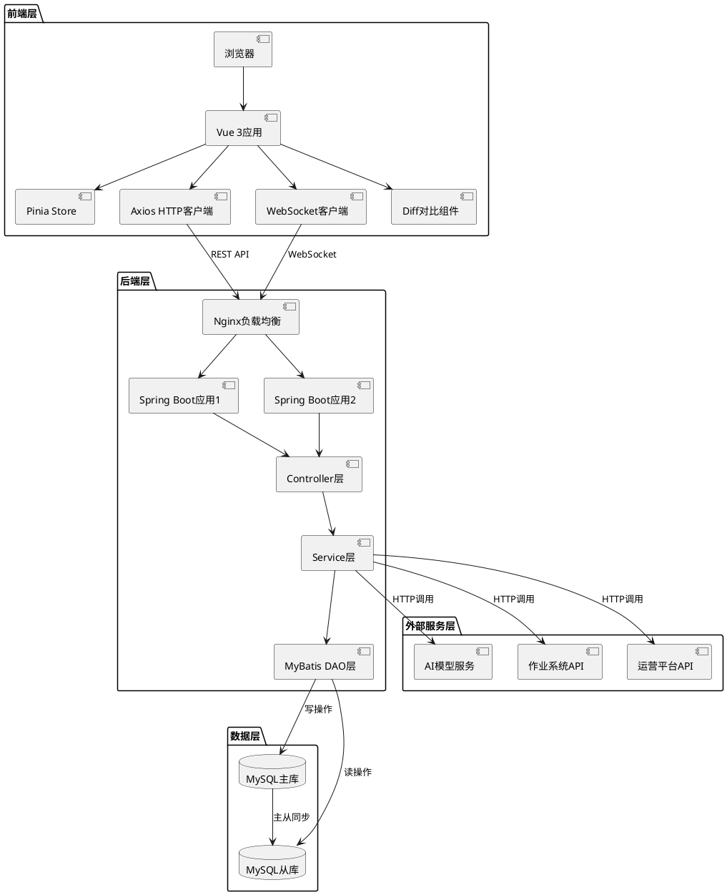

#### 2.1.2 前后端交互流程

**整体数据流**：
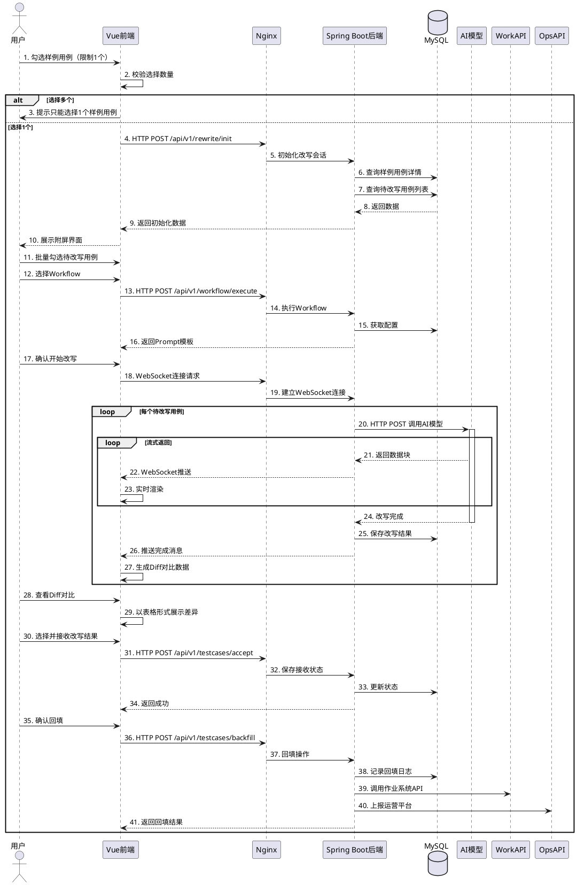

#### 2.1.3 技术栈对比

| 层次 | 前端技术栈 | 后端技术栈 |
|-----|----------|----------|
| 开发语言 | TypeScript | Java 8 |
| 框架 | Vue 3 | Spring Boot 2.7.x |
| 状态管理 | Pinia | - |
| HTTP通信 | Axios | RestTemplate / OkHttp |
| WebSocket | 原生WebSocket API | Spring WebSocket |
| 数据持久化 | LocalStorage / SessionStorage | MyBatis + MySQL |
| Diff组件 | vue-diff / 自研组件 | - |
| 构建工具 | Vite | Maven |
| 代码规范 | ESLint + Prettier | Checkstyle |
| 单元测试 | Vitest + Vue Test Utils | JUnit + Mockito |

#### 2.1.4 接口设计规范

**RESTful API规范**：
- 使用标准HTTP方法：GET（查询）、POST（创建）、PUT（更新）、DELETE（删除）
- URL路径使用名词复数形式：`/api/v1/testcases`、`/api/v1/workflows`
- 使用HTTP状态码：200（成功）、400（请求错误）、401（未授权）、500（服务器错误）
- 请求和响应统一使用JSON格式
- 统一响应结构：
```typescript
interface ApiResponse<T> {
    code: number;        // 业务状态码
    message: string;     // 提示信息
    data: T;            // 业务数据
    timestamp: number;   // 时间戳
    traceId: string;    // 追踪ID
}
```

**WebSocket消息规范**：
```typescript
interface WebSocketMessage {
    type: 'chunk' | 'complete' | 'error' | 'progress';  // 消息类型
    sessionId: string;                                   // 会话ID
    targetCaseId?: string;                              // 当前改写的用例ID
    data: any;                                          // 消息数据
    progress?: {                                        // 进度信息
        current: number;
        total: number;
    };
    timestamp: number;                                  // 时间戳
}
```

### 2.2 功能点清单

| 功能点ID | 功能点名称 | 优先级 | 说明 |
|---------|----------|-------|------|
| F001 | 样例用例选择与校验 | P0 | 从用例列表勾选样例用例，限制只能选1个 |
| F002 | 附屏界面框架 | P0 | 提供AI辅助用例改写的交互界面框架 |
| F003 | 样例用例信息展示 | P0 | 展示勾选的样例用例详细信息 |
| F004 | 待改写用例列表 | P0 | 展示待改写用例，支持批量勾选 |
| F005 | Workflow配置管理 | P0 | 展示和选择预配置的用例改写workflow |
| F006 | Workflow执行引擎 | P0 | 调用workflow并获取prompt模板和参数 |
| F007 | Prompt模板处理 | P0 | 拼装替换prompt模板中的占位参数 |
| F008 | AI模型批量调用服务 | P0 | 批量调用AI模型改写多个用例 |
| F009 | 流式结果展示 | P1 | 实时展示AI改写过程和结构化结果 |
| F010 | Diff对比展示 | P0 | 以表格形式展示改写前后的差异 |
| F011 | 改写结果接收与编辑 | P0 | 支持批量选择和接收AI改写的用例 |
| F012 | 重新生成机制 | P1 | 支持补充信息后重新改写 |
| F013 | 数据回填与上报 | P0 | 将改写的用例回填至作业系统并上报运营平台 |

### 2.3 功能点1：样例用例选择与校验

#### 2.3.1 前端设计

**功能说明**：
用户在TP->测试用例生成->新增用例列表中勾选一个样例用例，前端进行校验，若勾选多个则提示限制信息。

**前端交互流程**：
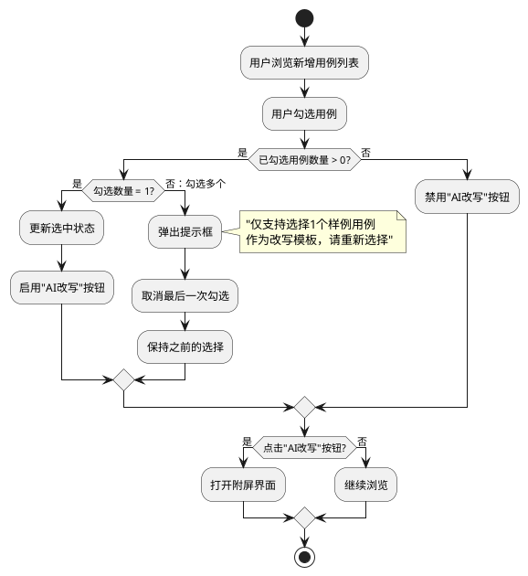

**前端组件设计**：
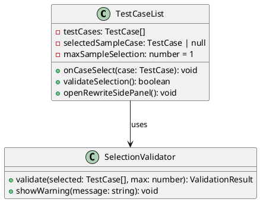

**前端状态管理**：
```typescript
// 样例用例选择Store
interface SampleCaseSelectionState {
    availableCases: TestCase[];          // 可选用例列表
    selectedSampleCase: TestCase | null; // 选中的样例用例
    validationError: string | null;      // 校验错误信息
}

const useSampleCaseStore = defineStore('sampleCase', {
    state: (): SampleCaseSelectionState => ({
        availableCases: [],
        selectedSampleCase: null,
        validationError: null
    }),
    
    actions: {
        selectSampleCase(testCase: TestCase) {
            // 直接替换为新选择的样例
            this.selectedSampleCase = testCase;
            this.validationError = null;
        },
        
        validateAndSelect(testCase: TestCase, currentSelected: TestCase | null) {
            if (currentSelected && currentSelected.id !== testCase.id) {
                // 已经选择了其他用例
                this.validationError = '仅支持选择1个样例用例作为改写模板，请先取消当前选择';
                return false;
            }
            
            this.selectSampleCase(testCase);
            return true;
        },
        
        clearSelection() {
            this.selectedSampleCase = null;
            this.validationError = null;
        }
    }
});
```

**前端数据结构**：
```typescript
interface TestCase {
    id: string;
    caseCode: string;              // 用例编号
    caseName: string;              // 用例名称
    description: string;           // 设计描述
    precondition: string;          // 前置条件
    testSteps: TestStep[];         // 测试步骤
    expectedResult: string;        // 预期结果
    priority: string;              // 优先级
    status: string;                // 状态
}

interface TestStep {
    stepNo: number;                // 步骤序号
    stepDesc: string;              // 步骤描述
    expectedResult: string;        // 步骤预期结果
}
```

#### 2.3.2 后端设计

**后端接口定义**：
```java
@RestController
@RequestMapping("/api/v1/testcases")
public class TestCaseController {
    
    @Autowired
    private TestCaseService testCaseService;
    
    @GetMapping("/new-cases")
    public ResponseEntity<GetNewTestCasesResponse> getNewTestCases(
            @RequestParam String tpId) {
        List<TestCase> newCases = testCaseService.getNewTestCasesByTpId(tpId);
        return ResponseEntity.ok(new GetNewTestCasesResponse(newCases));
    }
    
    @GetMapping("/{caseId}")
    public ResponseEntity<TestCaseDetail> getTestCaseDetail(
            @PathVariable String caseId) {
        TestCaseDetail detail = testCaseService.getTestCaseDetail(caseId);
        return ResponseEntity.ok(detail);
    }
}
```

**后端数据库表设计**：
```sql
-- 测试用例表
CREATE TABLE t_test_case (
    id VARCHAR(64) PRIMARY KEY COMMENT '用例ID',
    tp_id VARCHAR(64) NOT NULL COMMENT '测试计划ID',
    case_code VARCHAR(64) NOT NULL COMMENT '用例编号',
    case_name VARCHAR(256) NOT NULL COMMENT '用例名称',
    description TEXT COMMENT '设计描述',
    precondition TEXT COMMENT '前置条件',
    expected_result TEXT COMMENT '预期结果',
    priority VARCHAR(16) COMMENT '优先级',
    status VARCHAR(32) COMMENT '状态：new/rewriting/completed',
    create_time TIMESTAMP DEFAULT CURRENT_TIMESTAMP,
    update_time TIMESTAMP DEFAULT CURRENT_TIMESTAMP ON UPDATE CURRENT_TIMESTAMP,
    INDEX idx_tp_id (tp_id),
    INDEX idx_status (status),
    INDEX idx_case_code (case_code)
) COMMENT='测试用例表';

-- 测试步骤表
CREATE TABLE t_test_step (
    id VARCHAR(64) PRIMARY KEY COMMENT '步骤ID',
    case_id VARCHAR(64) NOT NULL COMMENT '用例ID',
    step_no INT NOT NULL COMMENT '步骤序号',
    step_desc TEXT COMMENT '步骤描述',
    expected_result TEXT COMMENT '步骤预期结果',
    create_time TIMESTAMP DEFAULT CURRENT_TIMESTAMP,
    update_time TIMESTAMP DEFAULT CURRENT_TIMESTAMP ON UPDATE CURRENT_TIMESTAMP,
    INDEX idx_case_id (case_id),
    INDEX idx_step_no (case_id, step_no)
) COMMENT='测试步骤表';
```

### 2.4 功能点2：附屏界面框架

#### 2.4.1 前端设计

**功能说明**：
参照TestMate交互方式，实现附屏界面框架，包含8个主要区域。

**界面结构**：
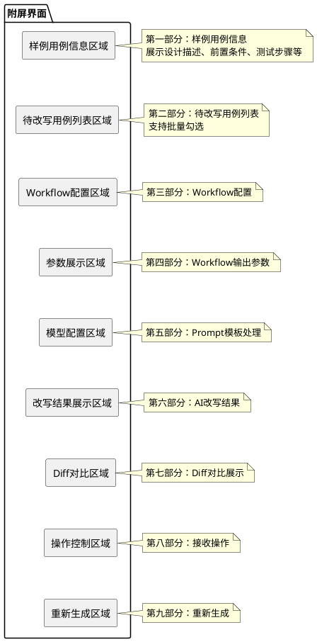

**前端组件结构**：
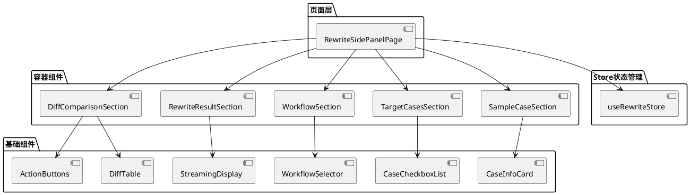

**前端技术栈**：
- 前端框架：Vue 3 + TypeScript
- UI组件库：Element Plus
- 状态管理：Pinia
- HTTP客户端：Axios
- WebSocket客户端：原生WebSocket API + 重连机制
- Diff组件：vue-diff 或自研表格Diff组件
- 构建工具：Vite
- 代码规范：ESLint + Prettier

**前端路由配置**：
```typescript
// 路由定义
const routes = [
    {
        path: '/tse/ai-testcase-rewrite',
        name: 'AITestCaseRewrite',
        component: () => import('@/views/RewriteSidePanelPage.vue'),
        meta: {
            title: 'AI辅助测试用例改写',
            requiresAuth: true
        }
    }
];
```

#### 2.4.2 后端设计

**后端技术栈**：
- 开发语言：Java 8
- 框架：Spring Boot 2.7.x
- Web框架：Spring MVC + Spring WebSocket
- ORM框架：MyBatis 3.5.x
- 数据库：MySQL 5.7+
- 连接池：HikariCP
- HTTP客户端：OkHttp / RestTemplate
- JSON处理：Jackson

**后端服务架构**：
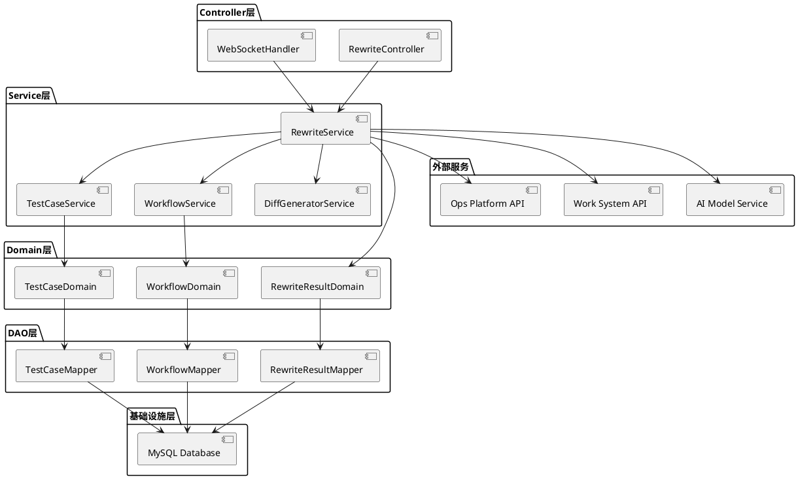

**后端数据库表设计**：
```sql
-- 改写会话表
CREATE TABLE t_rewrite_session (
    id VARCHAR(64) PRIMARY KEY COMMENT '会话ID',
    tp_id VARCHAR(64) NOT NULL COMMENT '测试计划ID',
    sample_case_id VARCHAR(64) NOT NULL COMMENT '样例用例ID',
    target_case_ids JSON COMMENT '待改写用例ID列表',
    workflow_id VARCHAR(64) COMMENT '使用的Workflow ID',
    session_status VARCHAR(32) COMMENT '会话状态：active/completed/failed',
    user_id VARCHAR(64) NOT NULL COMMENT '用户ID',
    create_time TIMESTAMP DEFAULT CURRENT_TIMESTAMP,
    update_time TIMESTAMP DEFAULT CURRENT_TIMESTAMP ON UPDATE CURRENT_TIMESTAMP,
    expire_time TIMESTAMP COMMENT '过期时间',
    INDEX idx_tp_id (tp_id),
    INDEX idx_user_id (user_id)
) COMMENT='改写会话表';
```

### 2.5 功能点3：样例用例信息展示

#### 2.5.1 前端设计

**功能说明**：
在附屏第一部分展示勾选的样例用例的基础信息，包括设计描述、前置条件、测试步骤等。

**前端组件设计**：
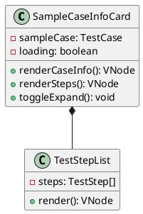

**前端展示结构**：
```typescript
// 样例用例展示数据结构
interface SampleCaseDisplay {
    caseCode: string;
    caseName: string;
    description: string;
    precondition: string;
    testSteps: TestStepDisplay[];
    expectedResult: string;
    priority: string;
}

interface TestStepDisplay {
    stepNo: number;
    stepDesc: string;
    expectedResult: string;
}
```

**前端UI布局**：
```
┌─────────────────────────────────────────────┐
│ 样例用例信息                                  │
├─────────────────────────────────────────────┤
│ 用例编号：TC001                              │
│ 用例名称：用户登录功能测试                     │
├─────────────────────────────────────────────┤
│ 设计描述：                                    │
│ 验证用户使用正确的用户名和密码能够成功登录系统   │
├─────────────────────────────────────────────┤
│ 前置条件：                                    │
│ 1. 系统已启动                                │
│ 2. 用户账号已注册且激活                       │
├─────────────────────────────────────────────┤
│ 测试步骤：                                    │
│ 步骤1：打开登录页面                          │
│   预期：显示登录表单                          │
│ 步骤2：输入用户名和密码                       │
│   预期：输入框显示内容                        │
│ 步骤3：点击登录按钮                          │
│   预期：跳转到首页                           │
├─────────────────────────────────────────────┤
│ 预期结果：                                    │
│ 用户成功登录并跳转到系统首页                   │
└─────────────────────────────────────────────┘
```

#### 2.5.2 后端设计

**后端接口实现**：
```java
@Service
public class TestCaseService {
    
    @Autowired
    private TestCaseMapper testCaseMapper;
    
    @Autowired
    private TestStepMapper testStepMapper;
    
    public TestCaseDetail getTestCaseDetail(String caseId) {
        // 查询用例基本信息
        TestCaseEntity caseEntity = testCaseMapper.findById(caseId);
        if (caseEntity == null) {
            throw new NotFoundException("用例不存在");
        }
        
        // 查询用例步骤
        List<TestStepEntity> steps = testStepMapper.findByCaseId(caseId);
        
        // 组装详情
        TestCaseDetail detail = new TestCaseDetail();
        detail.setId(caseEntity.getId());
        detail.setCaseCode(caseEntity.getCaseCode());
        detail.setCaseName(caseEntity.getCaseName());
        detail.setDescription(caseEntity.getDescription());
        detail.setPrecondition(caseEntity.getPrecondition());
        detail.setExpectedResult(caseEntity.getExpectedResult());
        detail.setPriority(caseEntity.getPriority());
        detail.setStatus(caseEntity.getStatus());
        
        List<TestStep> testSteps = new ArrayList<>();
        for (TestStepEntity stepEntity : steps) {
            TestStep step = new TestStep();
            step.setStepNo(stepEntity.getStepNo());
            step.setStepDesc(stepEntity.getStepDesc());
            step.setExpectedResult(stepEntity.getExpectedResult());
            testSteps.add(step);
        }
        detail.setTestSteps(testSteps);
        
        return detail;
    }
}
```

### 2.6 功能点4：待改写用例列表

#### 2.6.1 前端设计

**功能说明**：
展示当前TP下所有的新增用例（状态为"new"），支持用户批量勾选要改写的用例。

**前端组件设计**：
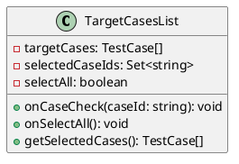

**前端交互流程**：
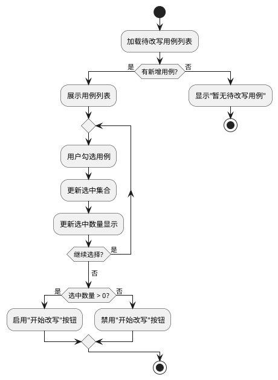

**前端状态管理**：
```typescript
// 待改写用例Store
interface TargetCasesState {
    targetCases: TestCase[];
    selectedCaseIds: Set<string>;
    loading: boolean;
}

const useTargetCasesStore = defineStore('targetCases', {
    state: (): TargetCasesState => ({
        targetCases: [],
        selectedCaseIds: new Set(),
        loading: false
    }),
    
    getters: {
        selectedCases: (state) => {
            return state.targetCases.filter(tc => 
                state.selectedCaseIds.has(tc.id)
            );
        },
        
        selectedCount: (state) => {
            return state.selectedCaseIds.size;
        }
    },
    
    actions: {
        async fetchTargetCases(tpId: string) {
            this.loading = true;
            try {
                const response = await api.getNewTestCases({ tpId });
                this.targetCases = response.testCases;
            } finally {
                this.loading = false;
            }
        },
        
        toggleCaseSelection(caseId: string) {
            if (this.selectedCaseIds.has(caseId)) {
                this.selectedCaseIds.delete(caseId);
            } else {
                this.selectedCaseIds.add(caseId);
            }
        },
        
        selectAll() {
            this.targetCases.forEach(tc => {
                this.selectedCaseIds.add(tc.id);
            });
        },
        
        clearSelection() {
            this.selectedCaseIds.clear();
        }
    }
});
```

**前端UI布局**：
```
┌─────────────────────────────────────────────────┐
│ 待改写用例列表 (已选 3/10)          [全选] [清空] │
├─────────────────────────────────────────────────┤
│ ☑ TC002 - 用户注册功能测试                       │
│ ☑ TC003 - 用户密码修改功能测试                   │
│ ☐ TC004 - 用户信息修改功能测试                   │
│ ☑ TC005 - 用户注销功能测试                       │
│ ☐ TC006 - 用户找回密码功能测试                   │
│ ...                                             │
└─────────────────────────────────────────────────┘
```

#### 2.6.2 后端设计

**后端接口实现**：
```java
@RestController
@RequestMapping("/api/v1/testcases")
public class TestCaseController {
    
    @Autowired
    private TestCaseService testCaseService;
    
    @GetMapping("/new-cases")
    public ResponseEntity<GetNewTestCasesResponse> getNewTestCases(
            @RequestParam String tpId) {
        List<TestCaseSummary> newCases = testCaseService.getNewTestCasesByTpId(tpId);
        return ResponseEntity.ok(new GetNewTestCasesResponse(newCases));
    }
}

@Service
public class TestCaseService {
    
    @Autowired
    private TestCaseMapper testCaseMapper;
    
    public List<TestCaseSummary> getNewTestCasesByTpId(String tpId) {
        // 查询状态为"new"的用例
        List<TestCaseEntity> entities = testCaseMapper.findByTpIdAndStatus(tpId, "new");
        
        List<TestCaseSummary> summaries = new ArrayList<>();
        for (TestCaseEntity entity : entities) {
            TestCaseSummary summary = new TestCaseSummary();
            summary.setId(entity.getId());
            summary.setCaseCode(entity.getCaseCode());
            summary.setCaseName(entity.getCaseName());
            summary.setPriority(entity.getPriority());
            summaries.add(summary);
        }
        
        return summaries;
    }
}
```

**后端接口定义**：
```typescript
// 获取新增用例列表
interface GetNewTestCasesRequest {
    tpId: string;
}

interface TestCaseSummary {
    id: string;
    caseCode: string;
    caseName: string;
    priority: string;
}

interface GetNewTestCasesResponse {
    testCases: TestCaseSummary[];
}
```

### 2.7 功能点5：Workflow配置管理

#### 2.7.1 前端设计

**功能说明**：
展示当前可用的测试用例改写workflow，支持用户切换选择。

**前端组件设计**：
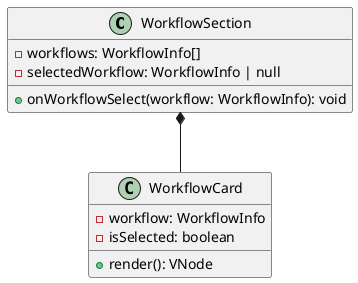

**前端API调用**：
```typescript
// Workflow API Service
export const workflowApi = {
    getRewriteWorkflows(): Promise<GetWorkflowsResponse> {
        return axios.get('/api/v1/workflows', {
            params: { workflowType: 'testcase_rewrite' }
        });
    }
};
```

#### 2.7.2 后端设计

**后端数据库表设计**：
```sql
-- Workflow配置表（复用之前的表结构，通过workflow_type区分）
-- workflow_type = 'testcase_rewrite' 表示测试用例改写workflow
```

**后端接口实现**：
```java
@RestController
@RequestMapping("/api/v1/workflows")
public class WorkflowController {
    
    @Autowired
    private WorkflowService workflowService;
    
    @GetMapping
    public ResponseEntity<GetWorkflowsResponse> getWorkflows(
            @RequestParam(required = false) String workflowType) {
        List<WorkflowInfo> workflows = workflowService.getActiveWorkflows(workflowType);
        return ResponseEntity.ok(new GetWorkflowsResponse(workflows));
    }
}
```

### 2.8 功能点6：AI模型批量调用服务

#### 2.8.1 前端设计

**功能说明**：
批量调用AI模型改写多个用例，通过WebSocket流式展示每个用例的改写进度和结果。

**前端WebSocket处理**：
```typescript
class RewriteWebSocketManager {
    private ws: WebSocket;
    private sessionId: string;
    
    public connect(sessionId: string): Promise<void> {
        return new Promise((resolve, reject) => {
            this.sessionId = sessionId;
            this.ws = new WebSocket(`ws://localhost:8080/ws/rewrite/${sessionId}`);
            
            this.ws.onopen = () => resolve();
            this.ws.onerror = (error) => reject(error);
            this.ws.onmessage = (event) => this.handleMessage(event);
        });
    }
    
    private handleMessage(event: MessageEvent) {
        const message: WebSocketMessage = JSON.parse(event.data);
        
        switch (message.type) {
            case 'progress':
                // 更新进度条
                this.updateProgress(message.progress);
                break;
            case 'chunk':
                // 流式内容
                this.appendContent(message.targetCaseId, message.data);
                break;
            case 'complete':
                // 单个用例完成
                this.markCaseComplete(message.targetCaseId);
                break;
            case 'error':
                // 错误处理
                this.handleError(message.data);
                break;
        }
    }
}
```

**前端进度展示**：
```
┌─────────────────────────────────────────────┐
│ 改写进度：2/5                                │
│ ▓▓▓▓▓▓▓▓▓▓▓▓▓▓▓▓▓▓░░░░░░░░░░░░░  40%      │
├─────────────────────────────────────────────┤
│ ✓ TC002 - 改写完成                          │
│ ✓ TC003 - 改写完成                          │
│ ⏳ TC004 - 正在改写中...                    │
│ ⏸ TC005 - 等待中                           │
│ ⏸ TC006 - 等待中                           │
└─────────────────────────────────────────────┘
```

#### 2.8.2 后端设计

**后端WebSocket处理器**：
```java
@Component
public class RewriteWebSocketHandler extends TextWebSocketHandler {
    
    @Autowired
    private RewriteService rewriteService;
    
    @Override
    public void afterConnectionEstablished(WebSocketSession session) throws Exception {
        String sessionId = extractSessionId(session);
        rewriteService.startRewrite(sessionId, session);
    }
    
    @Override
    protected void handleTextMessage(WebSocketSession session, TextMessage message) throws Exception {
        // 处理客户端消息（如取消改写）
    }
}

@Service
public class RewriteService {
    
    @Autowired
    private AIModelService aiModelService;
    
    public void startRewrite(String sessionId, WebSocketSession wsSession) {
        // 获取会话信息
        RewriteSession session = getRewriteSession(sessionId);
        
        // 获取样例用例和待改写用例列表
        TestCase sampleCase = getSampleCase(session.getSampleCaseId());
        List<TestCase> targetCases = getTargetCases(session.getTargetCaseIds());
        
        int total = targetCases.size();
        int current = 0;
        
        for (TestCase targetCase : targetCases) {
            current++;
            
            // 发送进度消息
            sendProgress(wsSession, current, total);
            
            // 构建prompt
            String prompt = buildRewritePrompt(sampleCase, targetCase);
            
            // 调用AI模型（流式）
            aiModelService.callModelStream(prompt, new StreamCallback() {
                @Override
                public void onChunk(String chunk) {
                    // 推送内容块
                    sendChunk(wsSession, targetCase.getId(), chunk);
                }
                
                @Override
                public void onComplete(String fullContent) {
                    // 解析并保存结果
                    TestCase rewrittenCase = parseRewrittenCase(fullContent);
                    saveRewriteResult(sessionId, targetCase.getId(), rewrittenCase);
                    
                    // 发送完成消息
                    sendComplete(wsSession, targetCase.getId());
                }
                
                @Override
                public void onError(Exception e) {
                    sendError(wsSession, targetCase.getId(), e.getMessage());
                }
            });
        }
    }
    
    private String buildRewritePrompt(TestCase sampleCase, TestCase targetCase) {
        StringBuilder prompt = new StringBuilder();
        prompt.append("请参考以下样例用例，改写目标用例：\n\n");
        prompt.append("【样例用例】\n");
        prompt.append("用例名称：").append(sampleCase.getCaseName()).append("\n");
        prompt.append("设计描述：").append(sampleCase.getDescription()).append("\n");
        prompt.append("前置条件：").append(sampleCase.getPrecondition()).append("\n");
        prompt.append("测试步骤：\n");
        for (TestStep step : sampleCase.getTestSteps()) {
            prompt.append("  步骤").append(step.getStepNo()).append("：")
                  .append(step.getStepDesc()).append("\n");
            prompt.append("    预期：").append(step.getExpectedResult()).append("\n");
        }
        prompt.append("预期结果：").append(sampleCase.getExpectedResult()).append("\n\n");
        
        prompt.append("【目标用例（待改写）】\n");
        prompt.append("用例名称：").append(targetCase.getCaseName()).append("\n");
        prompt.append("当前描述：").append(targetCase.getDescription()).append("\n\n");
        
        prompt.append("请按照样例用例的格式和风格，完善目标用例的设计描述、前置条件、测试步骤和预期结果。");
        prompt.append("返回JSON格式：{\"description\":\"...\",\"precondition\":\"...\",");
        prompt.append("\"testSteps\":[{\"stepNo\":1,\"stepDesc\":\"...\",\"expectedResult\":\"...\"}],");
        prompt.append("\"expectedResult\":\"...\"}");
        
        return prompt.toString();
    }
}
```

**后端数据库表设计**：
```sql
-- 改写结果表
CREATE TABLE t_rewrite_result (
    id VARCHAR(64) PRIMARY KEY COMMENT '结果ID',
    session_id VARCHAR(64) NOT NULL COMMENT '会话ID',
    original_case_id VARCHAR(64) NOT NULL COMMENT '原用例ID',
    rewritten_description TEXT COMMENT '改写后的设计描述',
    rewritten_precondition TEXT COMMENT '改写后的前置条件',
    rewritten_steps JSON COMMENT '改写后的测试步骤',
    rewritten_expected_result TEXT COMMENT '改写后的预期结果',
    is_accepted TINYINT DEFAULT 0 COMMENT '是否已接收',
    accepted_time TIMESTAMP COMMENT '接收时间',
    create_time TIMESTAMP DEFAULT CURRENT_TIMESTAMP,
    INDEX idx_session_id (session_id),
    INDEX idx_original_case_id (original_case_id)
) COMMENT='改写结果表';
```

### 2.9 功能点7：Diff对比展示

#### 2.9.1 前端设计

**功能说明**：
以表格形式展示改写前后的差异对比，维度包括：用例编号、设计描述、前置条件、测试步骤、预期结果等。

**前端Diff表格设计**：
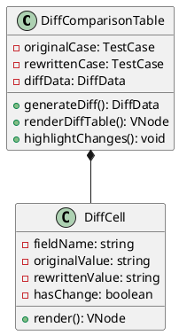

**前端Diff数据结构**：
```typescript
interface DiffData {
    caseCode: string;
    fields: DiffField[];
}

interface DiffField {
    fieldName: string;           // 字段名称
    fieldLabel: string;          // 字段标签
    originalValue: string;       // 原始值
    rewrittenValue: string;      // 改写后的值
    hasChange: boolean;          // 是否有变化
    changeType: 'added' | 'deleted' | 'modified' | 'unchanged';
}

// Diff计算函数
function calculateDiff(original: TestCase, rewritten: TestCase): DiffData {
    const fields: DiffField[] = [
        {
            fieldName: 'caseCode',
            fieldLabel: '用例编号',
            originalValue: original.caseCode,
            rewrittenValue: rewritten.caseCode,
            hasChange: false,
            changeType: 'unchanged'
        },
        {
            fieldName: 'description',
            fieldLabel: '设计描述',
            originalValue: original.description,
            rewrittenValue: rewritten.description,
            hasChange: original.description !== rewritten.description,
            changeType: calculateChangeType(original.description, rewritten.description)
        },
        {
            fieldName: 'precondition',
            fieldLabel: '前置条件',
            originalValue: original.precondition,
            rewrittenValue: rewritten.precondition,
            hasChange: original.precondition !== rewritten.precondition,
            changeType: calculateChangeType(original.precondition, rewritten.precondition)
        },
        // ... 其他字段
    ];
    
    return {
        caseCode: original.caseCode,
        fields
    };
}
```

**前端UI布局（表格方式）**：
```
┌──────────────────────────────────────────────────────────────┐
│ Diff对比 - TC002                                              │
├────────────┬────────────────────┬─────────────────────────────┤
│ 字段       │ 改写前             │ 改写后                       │
├────────────┼────────────────────┼─────────────────────────────┤
│ 用例编号   │ TC002              │ TC002                        │
├────────────┼────────────────────┼─────────────────────────────┤
│ 用例名称   │ 用户注册功能测试    │ 用户注册功能测试              │
├────────────┼────────────────────┼─────────────────────────────┤
│ 设计描述   │ (空)               │ 验证用户能够成功注册新账号并  │
│            │                    │ 激活，注册信息包括用户名、密  │
│            │                    │ 码、邮箱等必填项。[绿色高亮]  │
├────────────┼────────────────────┼─────────────────────────────┤
│ 前置条件   │ (空)               │ 1. 系统已启动               │
│            │                    │ 2. 注册页面可正常访问        │
│            │                    │ 3. 邮箱服务正常 [绿色高亮]   │
├────────────┼────────────────────┼─────────────────────────────┤
│ 测试步骤   │ (空)               │ 步骤1：打开注册页面          │
│            │                    │   预期：显示注册表单         │
│            │                    │ 步骤2：填写注册信息          │
│            │                    │   预期：表单验证通过         │
│            │                    │ 步骤3：点击注册按钮          │
│            │                    │   预期：提示注册成功 [绿色高亮]│
├────────────┼────────────────────┼─────────────────────────────┤
│ 预期结果   │ (空)               │ 用户成功注册并收到激活邮件    │
│            │                    │ [绿色高亮]                   │
└────────────┴────────────────────┴─────────────────────────────┘

图例：[绿色] 新增内容  [黄色] 修改内容  [红色] 删除内容
```

**前端Diff组件实现**：
```vue
<template>
  <div class="diff-comparison">
    <h3>Diff对比 - {{ diffData.caseCode }}</h3>
    <el-table :data="diffData.fields" border>
      <el-table-column prop="fieldLabel" label="字段" width="120" />
      <el-table-column label="改写前" width="300">
        <template #default="{ row }">
          <div 
            class="diff-cell" 
            :class="{ 'has-change': row.hasChange }"
          >
            {{ row.originalValue || '(空)' }}
          </div>
        </template>
      </el-table-column>
      <el-table-column label="改写后" width="300">
        <template #default="{ row }">
          <div 
            class="diff-cell"
            :class="getDiffClass(row)"
          >
            {{ row.rewrittenValue }}
          </div>
        </template>
      </el-table-column>
    </el-table>
  </div>
</template>

<script setup lang="ts">
function getDiffClass(row: DiffField) {
  if (!row.hasChange) return '';
  
  switch (row.changeType) {
    case 'added':
      return 'diff-added';
    case 'modified':
      return 'diff-modified';
    case 'deleted':
      return 'diff-deleted';
    default:
      return '';
  }
}
</script>

<style scoped>
.diff-added {
  background-color: #e6ffe6;
  color: #2d8a2d;
}

.diff-modified {
  background-color: #fff4e6;
  color: #d68900;
}

.diff-deleted {
  background-color: #ffe6e6;
  color: #d92d2d;
  text-decoration: line-through;
}
</style>
```

#### 2.9.2 后端设计

**后端Diff生成服务**：
```java
@Service
public class DiffGeneratorService {
    
    public DiffData generateDiff(TestCase original, TestCase rewritten) {
        DiffData diffData = new DiffData();
        diffData.setCaseCode(original.getCaseCode());
        
        List<DiffField> fields = new ArrayList<>();
        
        // 对比各个字段
        fields.add(createDiffField("caseCode", "用例编号", 
            original.getCaseCode(), rewritten.getCaseCode()));
        
        fields.add(createDiffField("caseName", "用例名称", 
            original.getCaseName(), rewritten.getCaseName()));
        
        fields.add(createDiffField("description", "设计描述", 
            original.getDescription(), rewritten.getDescription()));
        
        fields.add(createDiffField("precondition", "前置条件", 
            original.getPrecondition(), rewritten.getPrecondition()));
        
        // 测试步骤对比
        String originalSteps = formatSteps(original.getTestSteps());
        String rewrittenSteps = formatSteps(rewritten.getTestSteps());
        fields.add(createDiffField("testSteps", "测试步骤", 
            originalSteps, rewrittenSteps));
        
        fields.add(createDiffField("expectedResult", "预期结果", 
            original.getExpectedResult(), rewritten.getExpectedResult()));
        
        diffData.setFields(fields);
        return diffData;
    }
    
    private DiffField createDiffField(String fieldName, String fieldLabel, 
            String originalValue, String rewrittenValue) {
        DiffField field = new DiffField();
        field.setFieldName(fieldName);
        field.setFieldLabel(fieldLabel);
        field.setOriginalValue(originalValue);
        field.setRewrittenValue(rewrittenValue);
        
        // 判断变化类型
        if (isNullOrEmpty(originalValue) && !isNullOrEmpty(rewrittenValue)) {
            field.setChangeType("added");
            field.setHasChange(true);
        } else if (!isNullOrEmpty(originalValue) && isNullOrEmpty(rewrittenValue)) {
            field.setChangeType("deleted");
            field.setHasChange(true);
        } else if (!Objects.equals(originalValue, rewrittenValue)) {
            field.setChangeType("modified");
            field.setHasChange(true);
        } else {
            field.setChangeType("unchanged");
            field.setHasChange(false);
        }
        
        return field;
    }
    
    private String formatSteps(List<TestStep> steps) {
        if (steps == null || steps.isEmpty()) {
            return "";
        }
        
        StringBuilder sb = new StringBuilder();
        for (TestStep step : steps) {
            sb.append("步骤").append(step.getStepNo()).append("：")
              .append(step.getStepDesc()).append("\n");
            sb.append("  预期：").append(step.getExpectedResult()).append("\n");
        }
        return sb.toString();
    }
}
```

**后端接口定义**：
```typescript
// 获取Diff对比数据
interface GetDiffRequest {
    sessionId: string;
    originalCaseId: string;
}

interface DiffField {
    fieldName: string;
    fieldLabel: string;
    originalValue: string;
    rewrittenValue: string;
    hasChange: boolean;
    changeType: 'added' | 'deleted' | 'modified' | 'unchanged';
}

interface DiffData {
    caseCode: string;
    fields: DiffField[];
}

interface GetDiffResponse {
    diffData: DiffData;
}
```

### 2.10 功能点8：改写结果接收与编辑

#### 2.10.1 前端设计

**功能说明**：
用户可以批量选择改写结果并接收，支持在接收前查看Diff对比。

**前端交互流程**：
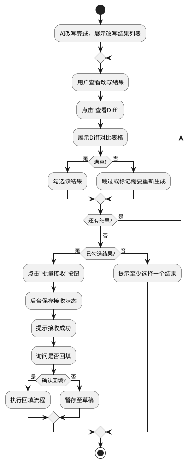

**前端状态管理**：
```typescript
interface RewriteResultsState {
    results: RewriteResult[];
    selectedResultIds: Set<string>;
}

interface RewriteResult {
    id: string;
    originalCaseId: string;
    caseCode: string;
    caseName: string;
    rewrittenCase: TestCase;
    diffData: DiffData;
    status: 'pending' | 'accepted' | 'rejected';
}

const useRewriteResultsStore = defineStore('rewriteResults', {
    actions: {
        async acceptResults(resultIds: string[]) {
            const response = await api.acceptRewriteResults({
                sessionId: this.sessionId,
                resultIds
            });
            
            // 更新状态
            resultIds.forEach(id => {
                const result = this.results.find(r => r.id === id);
                if (result) {
                    result.status = 'accepted';
                }
            });
        }
    }
});
```

#### 2.10.2 后端设计

**后端接口实现**：
```java
@RestController
@RequestMapping("/api/v1/rewrite-results")
public class RewriteResultController {
    
    @Autowired
    private RewriteResultService rewriteResultService;
    
    @PostMapping("/accept")
    public ResponseEntity<AcceptResultsResponse> acceptResults(
            @RequestBody AcceptResultsRequest request) {
        int acceptedCount = rewriteResultService.acceptResults(
            request.getSessionId(), 
            request.getResultIds(),
            request.getUserId()
        );
        
        return ResponseEntity.ok(new AcceptResultsResponse(acceptedCount));
    }
}

@Service
public class RewriteResultService {
    
    @Autowired
    private RewriteResultMapper rewriteResultMapper;
    
    @Transactional
    public int acceptResults(String sessionId, List<String> resultIds, String userId) {
        int count = 0;
        
        for (String resultId : resultIds) {
            RewriteResultEntity entity = rewriteResultMapper.findById(resultId);
            if (entity != null && entity.getSessionId().equals(sessionId)) {
                entity.setIsAccepted(1);
                entity.setAcceptedTime(new Date());
                rewriteResultMapper.update(entity);
                count++;
            }
        }
        
        return count;
    }
}
```

### 2.11 功能点9：重新生成机制

#### 2.11.1 前端设计

**功能说明**：
若AI改写的结果不符合预期，用户可以在输入框中补充信息并重新生成。

**前端UI布局**：
```
┌─────────────────────────────────────────────┐
│ 重新生成                                     │
├─────────────────────────────────────────────┤
│ 补充改写要求：                               │
│ ┌─────────────────────────────────────────┐ │
│ │ 请增加异常场景的测试步骤                 │ │
│ │ 前置条件需要更详细                       │ │
│ │                                         │ │
│ └─────────────────────────────────────────┘ │
│                                             │
│ [重新生成]                                  │
└─────────────────────────────────────────────┘
```

**前端处理逻辑**：
```typescript
async function regenerateRewrite(feedback: string) {
    const response = await api.regenerateRewrite({
        sessionId: currentSessionId,
        targetCaseIds: selectedCaseIds,
        feedbackText: feedback
    });
    
    // 重新建立WebSocket连接
    await connectWebSocket(response.newSessionId);
}
```

#### 2.11.2 后端设计

**后端实现**：
```java
@Service
public class RewriteService {
    
    public RegenerateResponse regenerateRewrite(String sessionId, 
            List<String> targetCaseIds, String feedbackText) {
        // 获取原始会话信息
        RewriteSession originalSession = getRewriteSession(sessionId);
        
        // 创建新会话
        String newSessionId = UUID.randomUUID().toString();
        RewriteSession newSession = new RewriteSession();
        newSession.setId(newSessionId);
        newSession.setSampleCaseId(originalSession.getSampleCaseId());
        newSession.setTargetCaseIds(targetCaseIds);
        newSession.setFeedbackText(feedbackText);
        saveRewriteSession(newSession);
        
        // 获取上次生成的prompt并优化
        String enhancedPrompt = enhancePromptWithFeedback(
            originalSession.getPrompt(), 
            feedbackText
        );
        newSession.setPrompt(enhancedPrompt);
        
        RegenerateResponse response = new RegenerateResponse();
        response.setNewSessionId(newSessionId);
        return response;
    }
    
    private String enhancePromptWithFeedback(String originalPrompt, String feedback) {
        StringBuilder enhanced = new StringBuilder(originalPrompt);
        enhanced.append("\n\n【用户反馈】\n");
        enhanced.append(feedback);
        enhanced.append("\n\n请根据用户反馈优化改写结果。");
        return enhanced.toString();
    }
}
```

### 2.12 功能点10：数据回填与上报

#### 2.12.1 前端设计

**功能说明**：
用户接收改写结果后，将数据回填至原作业系统，并上报至公司运营平台。

**前端确认对话框**：
```
┌─────────────────────────────────────────────┐
│ 确认回填                                     │
├─────────────────────────────────────────────┤
│ 即将回填 3 个改写后的用例：                   │
│ • TC002 - 用户注册功能测试                   │
│ • TC003 - 用户密码修改功能测试               │
│ • TC005 - 用户注销功能测试                   │
│                                             │
│ 回填后将覆盖原用例内容，是否继续？           │
│                                             │
│          [取消]      [确认回填]             │
└─────────────────────────────────────────────┘
```

#### 2.12.2 后端设计

**后端回填流程**：
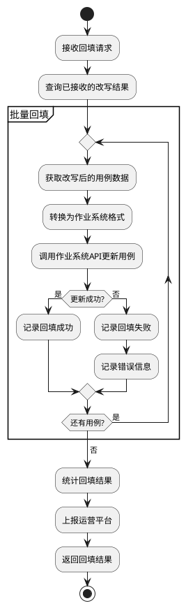

**后端接口实现**：
```java
@Service
public class BackfillService {
    
    @Autowired
    private RewriteResultService rewriteResultService;
    
    @Autowired
    private WorkSystemClient workSystemClient;
    
    @Autowired
    private OpsPlatformClient opsPlatformClient;
    
    @Transactional
    public BackfillResponse backfillRewrittenCases(String sessionId, List<String> resultIds) {
        List<RewriteResult> results = rewriteResultService.getResultsByIds(resultIds);
        
        int successCount = 0;
        int failedCount = 0;
        List<BackfillError> errors = new ArrayList<>();
        
        for (RewriteResult result : results) {
            try {
                // 转换为作业系统格式
                WorkSystemTestCase wsTestCase = convertToWorkSystemFormat(result);
                
                // 调用作业系统API
                workSystemClient.updateTestCase(wsTestCase);
                
                // 更新回填状态
                rewriteResultService.markBackfilled(result.getId());
                
                successCount++;
            } catch (Exception e) {
                failedCount++;
                errors.add(new BackfillError(result.getOriginalCaseId(), e.getMessage()));
            }
        }
        
        // 上报运营平台
        reportToOpsPlatform(sessionId, successCount, failedCount);
        
        BackfillResponse response = new BackfillResponse();
        response.setSuccessCount(successCount);
        response.setFailedCount(failedCount);
        response.setErrors(errors);
        
        return response;
    }
    
    private WorkSystemTestCase convertToWorkSystemFormat(RewriteResult result) {
        WorkSystemTestCase wsCase = new WorkSystemTestCase();
        wsCase.setCaseId(result.getOriginalCaseId());
        wsCase.setDescription(result.getRewrittenDescription());
        wsCase.setPrecondition(result.getRewrittenPrecondition());
        wsCase.setTestSteps(convertSteps(result.getRewrittenSteps()));
        wsCase.setExpectedResult(result.getRewrittenExpectedResult());
        wsCase.setRewriteMethod("AI");
        return wsCase;
    }
    
    private void reportToOpsPlatform(String sessionId, int successCount, int failedCount) {
        OpsPlatformReport report = new OpsPlatformReport();
        report.setSessionId(sessionId);
        report.setRewriteCount(successCount + failedCount);
        report.setSuccessCount(successCount);
        report.setFailedCount(failedCount);
        report.setReportTime(new Date());
        
        opsPlatformClient.report(report);
    }
}
```

**后端数据库表设计**：
```sql
-- 回填记录表
CREATE TABLE t_backfill_record (
    id VARCHAR(64) PRIMARY KEY COMMENT '回填记录ID',
    session_id VARCHAR(64) COMMENT '会话ID',
    result_ids JSON COMMENT '改写结果ID列表',
    success_count INT COMMENT '成功数量',
    failed_count INT COMMENT '失败数量',
    backfill_status VARCHAR(32) COMMENT '回填状态',
    backfill_time TIMESTAMP COMMENT '回填时间',
    report_status VARCHAR(32) COMMENT '上报状态',
    report_time TIMESTAMP COMMENT '上报时间',
    error_message TEXT COMMENT '错误信息',
    create_time TIMESTAMP DEFAULT CURRENT_TIMESTAMP,
    INDEX idx_session_id (session_id)
) COMMENT='回填记录表';
```

## 3 DFX分析

### 3.1 可靠性（Reliability）

**策略**：
1. **重试机制**：AI模型调用失败时，自动重试3次，重试间隔采用指数退避策略（1s、2s、4s）
2. **降级方案**：当AI服务不可用时，允许用户手工编辑用例
3. **数据持久化**：每次改写的中间结果都持久化到数据库，防止数据丢失
4. **事务保障**：
   - 使用Spring @Transactional管理本地事务
   - 回填操作记录详细日志，支持手工补偿
   - 关键操作支持幂等性设计
5. **批量处理保护**：批量改写时，单个用例失败不影响其他用例的处理

**监控指标**：
- AI服务可用率 > 99.5%
- 单次改写成功率 > 95%
- 数据回填成功率 > 98%

### 3.2 性能（Performance）

**性能目标**：
| 操作 | 响应时间 | 并发支持 |
|------|---------|---------|
| 用例列表加载 | < 1s | 1000 QPS |
| 样例用例详情加载 | < 500ms | 1000 QPS |
| Workflow执行 | < 3s | 500 QPS |
| AI模型调用（单个用例） | < 10s | 100 QPS |
| Diff对比生成 | < 500ms | 500 QPS |
| 批量回填（10个用例） | < 10s | 100 QPS |

**优化策略**：
1. **数据库优化**：
   - 为高频查询字段添加索引（tp_id, status, case_code等）
   - 使用HikariCP连接池，配置最小连接数=10，最大连接数=50
   - 测试步骤使用JSON存储，减少表关联查询
2. **连接池优化**：
   - HTTP连接池大小=20，连接超时=5s，读超时=30s
   - WebSocket连接池最大并发=100
3. **批量处理优化**：
   - 批量改写采用异步并发处理，最大并发数=5
   - 使用线程池管理并发任务
4. **前端优化**：
   - Diff对比数据前端计算，减少后端压力
   - 使用虚拟滚动加载大量用例列表
5. **CDN加速**：静态资源使用CDN分发

### 3.3 安全性（Security）

**安全措施**：
1. **身份认证**：所有API请求需携带JWT Token，Token有效期2小时
2. **权限控制**：基于RBAC模型，区分测试工程师、测试管理员角色
3. **数据加密**：
   - 传输层：强制使用HTTPS（TLS 1.3）
   - 存储层：敏感字段（API Key）使用AES-256加密
4. **Prompt注入防护**：
   - 用户输入长度限制：补充信息 < 1000字符
   - 敏感词过滤：过滤SQL注入、XSS攻击字符
   - Prompt模板沙箱：使用白名单机制限制模板内容
5. **数据隔离**：
   - 用户只能访问自己参与的TP下的用例
   - 会话数据按用户隔离
6. **审计日志**：记录所有关键操作，包括用户、时间、操作内容
7. **限流保护**：
   - 单用户：20个用例改写/小时
   - 单IP：100次API请求/分钟

### 3.4 可维护性（Maintainability）

**设计原则**：
1. **模块化设计**：前后端分离，业务逻辑分层（Controller-Service-DAO）
2. **配置外部化**：
   - 使用Spring Boot配置文件（application.yml/application.properties）
   - 支持多环境配置（dev、test、prod）
   - 敏感配置（API密钥）通过环境变量注入
3. **日志规范**：
   - 使用SLF4J + Logback统一日志框架
   - 日志格式包含：时间戳、日志级别、sessionId、类名、方法名、消息
   - 按天滚动归档，保留30天
4. **监控告警**：
   - 使用Spring Boot Actuator暴露健康检查端点
   - 关键业务指标记录到数据库，定时巡检
   - 关键指标告警：AI调用失败率 > 5%、响应时间 > 15s
5. **版本管理**：
   - API版本化：/api/v1/、/api/v2/
   - Workflow版本管理：通过数据库version字段支持多版本并存

### 3.5 可扩展性（Scalability）

**扩展能力**：
1. **水平扩展**：
   - 无状态服务设计，支持多实例部署
   - 使用Nginx进行负载均衡
2. **AI模型可插拔**：
   - 通过t_ai_model_config表配置支持接入多个AI供应商
   - 支持OpenAI、Claude、文心一言、通义千问等
3. **Workflow扩展**：
   - 通过t_workflow_config表新增workflow配置
   - 无需代码变更，重启服务即可生效
4. **存储扩展**：
   - 数据库支持分库分表
   - 建议按年份或tp_id范围进行分表
5. **功能扩展**：
   - 支持自定义Diff对比维度
   - 支持导出改写报告
   - 支持改写历史版本管理

### 3.6 可用性（Availability）

**高可用方案**：
1. **服务部署**：至少2个实例，部署在不同可用区
2. **数据库**：
   - 主从架构（一主一从），自动故障切换（RTO < 5分钟）
   - 定期进行主从同步延迟监控
3. **负载均衡**：使用Nginx做负载均衡，健康检查间隔10s
4. **熔断降级**：
   - 使用Hystrix或自研熔断组件实现服务降级
   - 熔断阈值：10秒内错误率 > 50%
   - AI服务超时或失败时，提示用户手工编辑
5. **备份恢复**：
   - 数据库每日全量备份，保留7天
   - 增量备份每小时一次
   - 定期进行恢复演练
6. **WebSocket重连**：
   - 客户端自动重连机制，最多重试5次
   - 断点续传支持，记录最后处理的用例ID

## 4 测试分析

### 4.1 测试策略

基于需求特点，采用以下测试策略：
1. **单元测试**：覆盖率 > 80%，重点测试业务逻辑层
2. **接口测试**：覆盖所有RESTful API和WebSocket接口
3. **集成测试**：测试与作业系统、运营平台的集成
4. **端到端测试**：模拟完整的用户操作流程
5. **性能测试**：验证性能指标是否满足要求
6. **安全测试**：渗透测试、Prompt注入测试
7. **Diff对比准确性测试**：验证Diff计算逻辑的正确性

### 4.2 测试用例

#### 4.2.1 功能测试场景

| 场景ID | 测试场景 | 测试方法 | 优先级 |
|--------|---------|---------|-------|
| TC001 | 样例用例选择校验 | 验证只能选择1个样例用例 | P0 |
| TC002 | 附屏界面正常加载 | 验证所有区域数据完整性 | P0 |
| TC003 | 样例用例信息展示 | 验证详细信息正确展示 | P0 |
| TC004 | 待改写用例批量勾选 | 验证可勾选多个用例 | P0 |
| TC005 | Workflow配置选择 | 验证可选择不同类型workflow | P0 |
| TC006 | AI批量改写功能 | 验证可批量改写多个用例 | P0 |
| TC007 | 流式输出展示 | 验证WebSocket连接、数据实时推送 | P1 |
| TC008 | Diff对比展示 | 验证表格形式展示差异 | P0 |
| TC009 | 改写结果批量接收 | 验证可选择多个结果并保存 | P0 |
| TC010 | 补充信息重新生成 | 验证新生成结果符合补充要求 | P1 |
| TC011 | 数据回填作业系统 | 验证用例正确更新 | P0 |
| TC012 | 数据上报运营平台 | 验证上报数据准确 | P0 |

#### 4.2.2 异常场景测试

| 场景ID | 测试场景 | 预期结果 | 优先级 |
|--------|---------|---------|-------|
| TC101 | 选择多个样例用例 | 提示限制信息，取消多余选择 | P0 |
| TC102 | AI服务超时 | 提示超时，支持重试 | P0 |
| TC103 | AI返回非法JSON | 解析失败提示，不崩溃 | P0 |
| TC104 | WebSocket断连 | 自动重连，恢复上下文 | P1 |
| TC105 | 作业系统API失败 | 提示回填失败，支持重试 | P0 |
| TC106 | 批量改写部分失败 | 成功的继续处理，失败的记录错误 | P1 |
| TC107 | 超长补充信息 | 截断或提示长度限制 | P2 |
| TC108 | 恶意Prompt注入 | 过滤敏感内容，不执行 | P0 |
| TC109 | 数据库连接失败 | 降级处理，提示系统异常 | P0 |
| TC110 | 并发改写冲突 | 正确处理并发请求，不丢数据 | P1 |

#### 4.2.3 性能测试场景

| 场景ID | 测试场景 | 测试方法 | 性能目标 |
|--------|---------|---------|---------|
| PT001 | 用例列表加载性能 | JMeter压测，1000并发 | 响应时间 < 1s，成功率 > 99% |
| PT002 | AI单个用例改写时间 | 单次调用计时 | 完成时间 < 10s |
| PT003 | 批量改写10个用例 | 并发执行 | 总耗时 < 60s |
| PT004 | Diff对比生成性能 | 测试100个用例 | 单个用例 < 500ms |
| PT005 | 并发WebSocket | 50个并发WebSocket连接 | 无连接失败，无消息丢失 |
| PT006 | 回填性能测试 | 回填100个用例 | 总耗时 < 100s |
| PT007 | 长时间运行稳定性 | 连续运行8小时 | 内存泄漏 < 10%，无崩溃 |

#### 4.2.4 安全测试场景

| 场景ID | 测试场景 | 测试方法 | 优先级 |
|--------|---------|---------|-------|
| ST001 | 未授权访问 | 不携带Token访问API | 返回401 | P0 |
| ST002 | Token过期 | 使用过期Token访问 | 返回401，提示重新登录 | P0 |
| ST003 | SQL注入攻击 | 补充信息包含SQL语句 | 过滤，不执行 | P0 |
| ST004 | XSS攻击 | 用例描述包含脚本 | 转义，不执行 | P0 |
| ST005 | Prompt注入 | 恶意prompt尝试绕过限制 | 检测并拒绝 | P0 |
| ST006 | 越权访问 | 访问其他用户的用例 | 返回403 | P0 |
| ST007 | 跨用户数据泄露 | 查看其他TP的改写记录 | 返回空或403 | P0 |
| ST008 | API密钥泄露 | 查看返回数据中的密钥 | 密钥已脱敏 | P0 |

#### 4.2.5 Diff对比测试场景

| 场景ID | 测试场景 | 预期结果 | 优先级 |
|--------|---------|---------|-------|
| DT001 | 全空用例改写 | Diff正确标记所有字段为"新增" | P0 |
| DT002 | 部分字段修改 | Diff正确标记修改字段 | P0 |
| DT003 | 测试步骤增加 | Diff正确显示新增步骤 | P0 |
| DT004 | 测试步骤减少 | Diff正确显示删除步骤 | P0 |
| DT005 | 测试步骤顺序调整 | Diff正确显示顺序变化 | P1 |
| DT006 | 无任何变化 | Diff显示所有字段unchanged | P1 |
| DT007 | 特殊字符处理 | Diff正确转义特殊字符 | P0 |

### 4.3 测试环境

**环境配置**：
- 开发环境（DEV）：用于开发自测
- 测试环境（TEST）：用于功能测试、集成测试
- 预发布环境（STAGE）：用于性能测试、安全测试
- 生产环境（PROD）：真实用户使用

**Mock服务**：
- Mock AI服务：返回预定义的改写结果数据
- Mock作业系统API：模拟回填成功/失败
- Mock运营平台API：模拟上报成功

### 4.4 测试数据

**测试数据准备**：
1. **样例用例**：准备10个高质量的样例用例（覆盖不同功能模块）
2. **待改写用例**：准备50个新增用例（部分空白、部分简略）
3. **Workflow配置**：配置3个不同的用例改写workflow
4. **AI模型响应**：准备正常响应、异常响应、超长响应等多种场景数据
5. **用户数据**：准备不同权限的测试用户账号

### 4.5 验收标准

功能达到验收标准需满足：
1. 所有P0测试用例通过率 = 100%
2. 所有P1测试用例通过率 ≥ 95%
3. 性能指标满足3.2节要求
4. 安全测试无高危、严重漏洞
5. Diff对比准确率 = 100%
6. 代码覆盖率 ≥ 80%
7. 生产环境试运行1周，无严重故障
8. 用户满意度 ≥ 85%

---

**文档版本**：v1.0  
**编写日期**：2025-10-14  
**编写人**：AI助手  
**审核人**：待定  

