# 基于相似用例检索的全测试脚本生成 - AR设计文档

## 1 需求重述

### 1.1 需求背景

2024年我们探索了单步骤测试代码生成，通过基于步骤拼接的方式生成整个测试代码，但存在步骤间一致性不足的问题。

2025年，分组UPCF团队和数据工程团队联合探索了基于相似用例检索的全脚本生成方案。经过实验验证，在测试集上的全脚本生成准确率从63%提升到了78%。

为了固化该方案，需要将其工程化并集成到TestMate（IDE插件）中。本文档对工程化实现方案进行详细设计。

### 1.2 需求功能介绍

本需求主要包含以下核心功能：

1. **用例入库功能**：支持将版本用例统一入RAG库，提供入库触发入口
2. **相似用例检索配置**：支持配置检索参数和阈值
3. **相似用例检索服务**：提供相似用例检索接口服务
4. **全脚本生成流程**：在IDE插件中实现完整的脚本生成流程，包括用例选择、相似用例检索、脚本生成和审查

## 2 功能实现分析

### 2.0 系统整体架构

#### 系统架构图

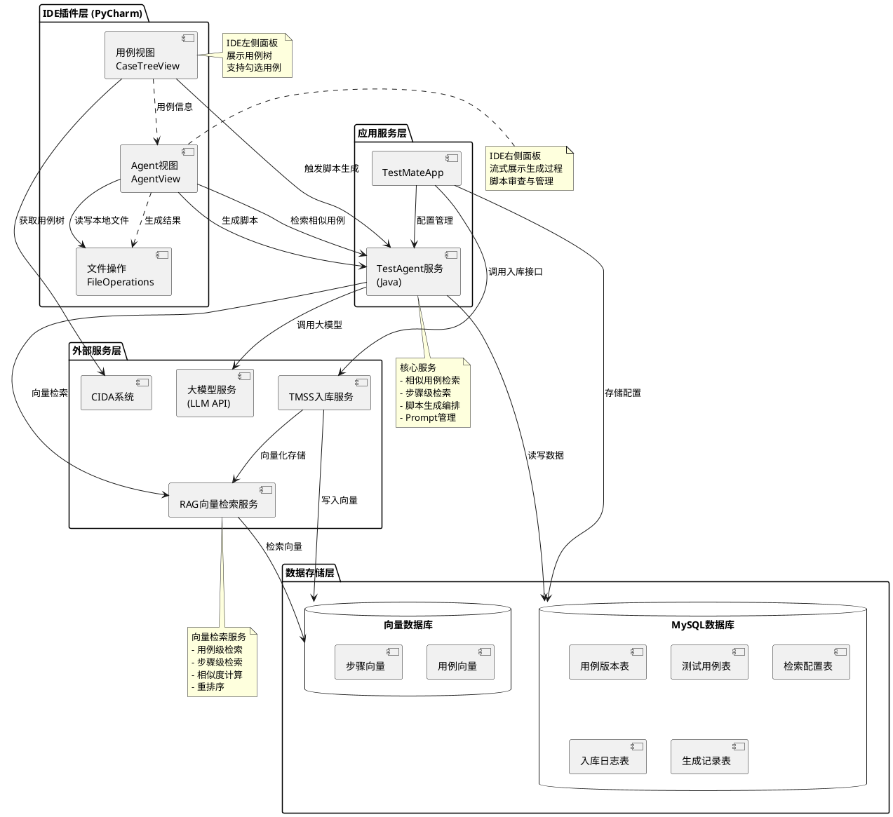

#### 系统交互流程图

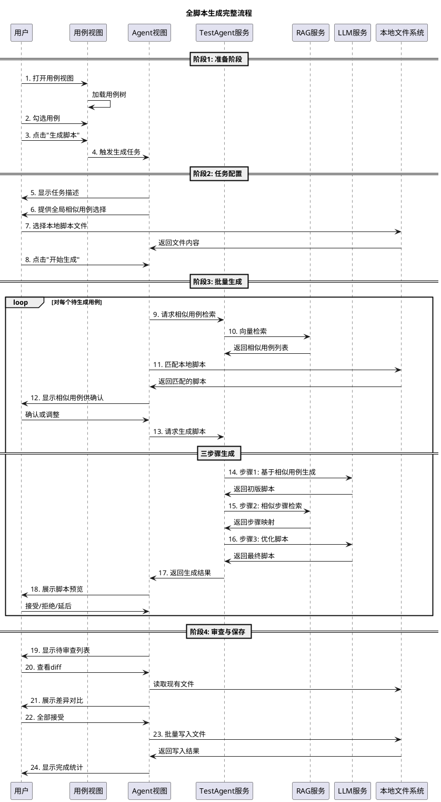

#### 技术栈说明

**前端（IDE插件）**
- 平台：IntelliJ Platform SDK (PyCharm)
- 语言：Java/Kotlin
- UI框架：Swing
- 通信：HTTP Client

**后端服务**
- TestAgent服务：Java (Spring Boot)
- TestMateApp：Web应用
- API网关：统一入口

**数据存储**
- 关系数据库：MySQL 8.0+
- 向量数据库：按RAG服务要求配置
- 临时存储：本地文件系统

**外部依赖**
- CIDA系统：用例管理系统
- TMSS服务：入库服务
- RAG服务：向量检索服务
- LLM API：支持GPT-4、Claude等

### 2.1 功能点清单

- 功能点1：用例入库管理
- 功能点2：相似用例检索配置管理
- 功能点3：相似用例检索服务
- 功能点4：TestMate插件用例视图
- 功能点5：TestMate插件Agent视图
- 功能点6：相似用例匹配与选择
- 功能点7：全脚本生成引擎
- 功能点8：脚本审查与管理

### 2.2 功能点1：用例入库管理

#### 详细描述

**功能概述**：
支持用户将CIDA用例版本批量入库到统一的RAG库中，为后续的相似用例检索提供数据基础。

**业务流程**：
```
用户打开TestMateApp → 选择用例版本 → 触发入库 → 调用TMSS团队提供的入库接口 → 用例数据写入RAG库 → 返回入库结果
```

**主要实体**：
- **用例版本实体**：包括版本号、版本名称、用例数量、创建时间等
- **用例实体**：包括用例编号、用例名称、预制步骤、测试步骤、预期结果等

**接口定义**：
- 接口名称：批量入库接口
- 接口提供方：TMSS团队（已有）
- 输入参数：用例版本列表、用例数据集合
- 输出结果：入库状态、成功数量、失败数量及原因

**数据流向**：
```
TestMateApp → TMSS入库接口 → RAG库存储
```

#### 数据库表设计

**表1：test_case_version（用例版本表）**

| 字段名 | 类型 | 约束 | 说明 |
|--------|------|------|------|
| version_id | BIGINT | PRIMARY KEY | 版本ID |
| version_name | VARCHAR(255) | NOT NULL | 版本名称 |
| version_number | VARCHAR(100) | NOT NULL | 版本号 |
| case_count | INT | DEFAULT 0 | 用例数量 |
| storage_status | VARCHAR(50) | NOT NULL | 入库状态：PENDING/IN_PROGRESS/SUCCESS/FAILED |
| created_time | DATETIME | NOT NULL | 创建时间 |
| updated_time | DATETIME | NOT NULL | 更新时间 |
| created_by | VARCHAR(100) | NOT NULL | 创建人 |

**表2：test_case（测试用例表）**

| 字段名 | 类型 | 约束 | 说明 |
|--------|------|------|------|
| case_id | BIGINT | PRIMARY KEY | 用例ID |
| case_number | VARCHAR(100) | NOT NULL, UNIQUE | 用例编号 |
| case_name | VARCHAR(500) | NOT NULL | 用例名称 |
| version_id | BIGINT | FOREIGN KEY | 版本ID |
| pre_steps | TEXT | NULL | 预制步骤 |
| test_steps | TEXT | NOT NULL | 测试步骤 |
| expected_result | TEXT | NOT NULL | 预期结果 |
| rag_stored | BOOLEAN | DEFAULT FALSE | 是否已入RAG库 |
| rag_vector_id | VARCHAR(255) | NULL | RAG向量ID |
| created_time | DATETIME | NOT NULL | 创建时间 |
| updated_time | DATETIME | NOT NULL | 更新时间 |

**表3：case_storage_log（用例入库日志表）**

| 字段名 | 类型 | 约束 | 说明 |
|--------|------|------|------|
| log_id | BIGINT | PRIMARY KEY | 日志ID |
| version_id | BIGINT | FOREIGN KEY | 版本ID |
| total_count | INT | NOT NULL | 总用例数 |
| success_count | INT | DEFAULT 0 | 成功数量 |
| failed_count | INT | DEFAULT 0 | 失败数量 |
| error_message | TEXT | NULL | 错误信息 |
| start_time | DATETIME | NOT NULL | 开始时间 |
| end_time | DATETIME | NULL | 结束时间 |
| operator | VARCHAR(100) | NOT NULL | 操作人 |

#### 数据实体关系图

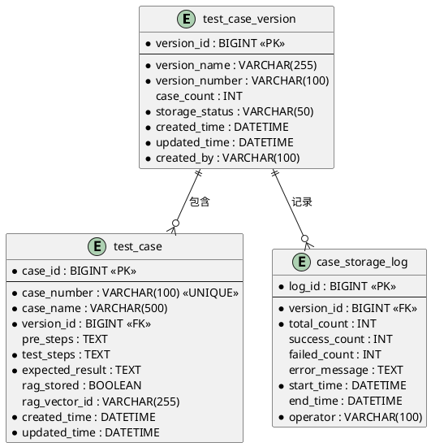

#### 用例入库序列图

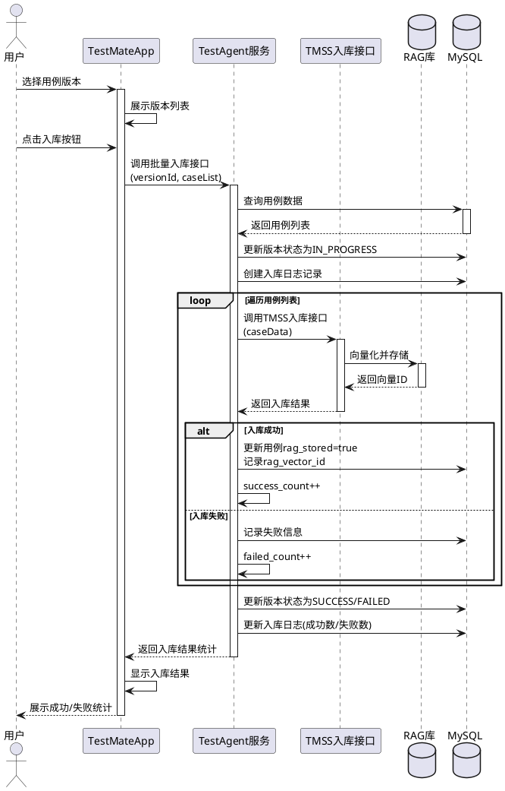

### 2.3 功能点2：相似用例检索配置管理

#### 详细描述

**功能概述**：
在TestMateApp页面上提供相似用例检索的配置管理功能，支持用户灵活配置检索策略。

**配置项说明**：

1. **TOP数量配置**
   - 配置项：相似用例返回数量
   - 取值范围：1-10
   - 默认值：5
   - 说明：控制检索返回的相似用例数量

2. **检索参数配置**
   - 用例名称：是否作为检索字段
   - 用例编号：是否作为检索字段
   - 预制步骤：是否作为检索字段
   - 测试步骤：是否作为检索字段
   - 预期结果：是否作为检索字段
   - 说明：支持多选，至少选择一项

3. **步骤覆盖重排序阈值**
   - 配置项：步骤覆盖度阈值
   - 取值范围：0-1
   - 默认值：0.7
   - 说明：用于对检索结果进行重排序的阈值

**数据存储**：
配置信息按用例版本维度存储，支持不同版本使用不同的检索配置。

**配置实体关系**：
```
检索配置实体
├── 配置ID
├── 用例版本ID
├── TOP数量
├── 检索字段配置
│   ├── 用例名称（是/否）
│   ├── 用例编号（是/否）
│   ├── 预制步骤（是/否）
│   ├── 测试步骤（是/否）
│   └── 预期结果（是/否）
├── 步骤覆盖重排序阈值
├── 创建时间
└── 更新时间
```

#### 数据库表设计

**表4：search_config（检索配置表）**

| 字段名 | 类型 | 约束 | 说明 |
|--------|------|------|------|
| config_id | BIGINT | PRIMARY KEY | 配置ID |
| version_id | BIGINT | FOREIGN KEY, UNIQUE | 版本ID（每个版本唯一配置）|
| top_count | INT | NOT NULL, DEFAULT 5 | TOP数量，范围1-10 |
| use_case_name | BOOLEAN | NOT NULL, DEFAULT TRUE | 是否使用用例名称检索 |
| use_case_number | BOOLEAN | NOT NULL, DEFAULT TRUE | 是否使用用例编号检索 |
| use_pre_steps | BOOLEAN | NOT NULL, DEFAULT TRUE | 是否使用预制步骤检索 |
| use_test_steps | BOOLEAN | NOT NULL, DEFAULT TRUE | 是否使用测试步骤检索 |
| use_expected_result | BOOLEAN | NOT NULL, DEFAULT TRUE | 是否使用预期结果检索 |
| coverage_threshold | DECIMAL(3,2) | NOT NULL, DEFAULT 0.70 | 步骤覆盖重排序阈值，范围0-1 |
| created_time | DATETIME | NOT NULL | 创建时间 |
| updated_time | DATETIME | NOT NULL | 更新时间 |
| created_by | VARCHAR(100) | NOT NULL | 创建人 |

#### 配置管理类图

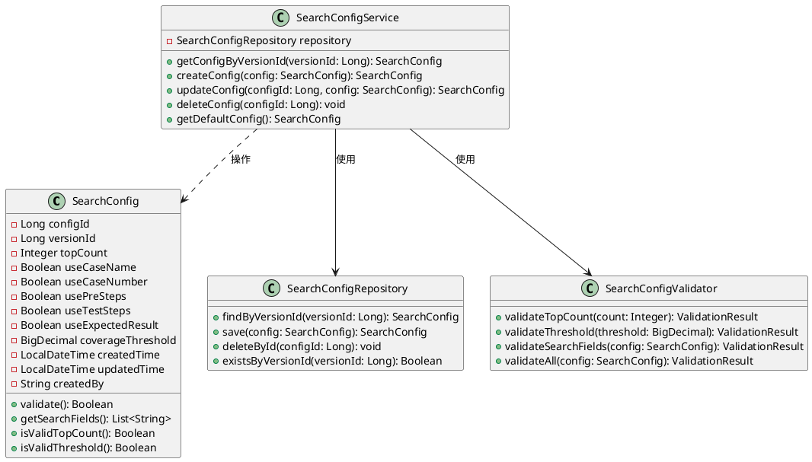

#### 配置管理流程图

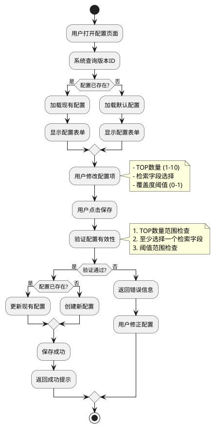

### 2.4 功能点3：相似用例检索服务

#### 详细描述

**功能概述**：
在TestAgent服务（Java）中提供相似用例检索接口，根据输入的用例信息和配置参数，调用RAG服务返回相似用例列表。

**服务流程**：
```
1. 接收检索请求（用例信息+版本号）
2. 根据版本号获取该版本的检索配置
3. 构建检索请求参数
4. 调用RAG服务进行向量检索
5. 对检索结果进行重排序（基于步骤覆盖度）
6. 返回TOP-N相似用例列表
```

**接口定义**：
- 接口名称：相似用例检索接口
- 请求参数：
  - 用例名称
  - 用例编号
  - 预制步骤
  - 测试步骤
  - 预期结果
  - 用例版本
- 响应结果：
  - 相似用例列表（最多TOP-N个）
  - 每个相似用例包含：用例编号、用例名称、相似度得分、步骤覆盖度

**重排序算法逻辑**：
基于步骤覆盖度对初始检索结果进行重排序，优先返回步骤覆盖更全面的相似用例。

#### 相似用例检索序列图

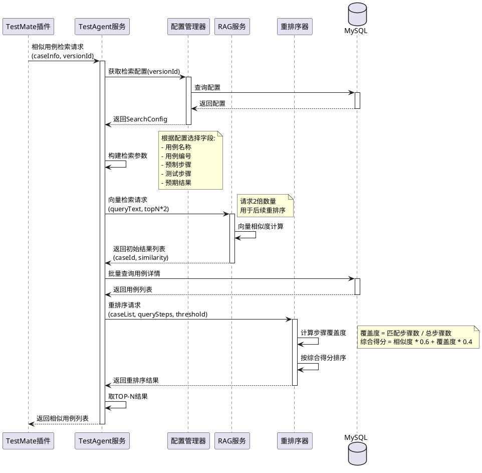

#### 检索服务流程图

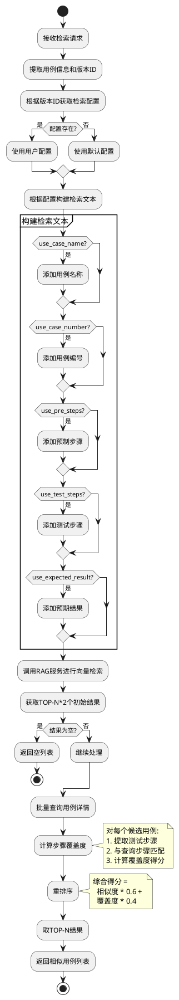

#### 接口定义

**接口1：相似用例检索接口**

```
接口名称: searchSimilarCases
请求方式: POST
路径: /api/v1/similar-cases/search

请求参数 (SimilarCaseSearchRequest):
{
  "caseName": "用户登录功能测试",           // String, 必填
  "caseNumber": "TC001",                   // String, 必填
  "preSteps": "1. 打开登录页面...",        // String, 可选
  "testSteps": "1. 输入用户名...",         // String, 必填
  "expectedResult": "登录成功...",          // String, 必填
  "versionId": 12345,                      // Long, 必填
  "topN": 5                                 // Integer, 可选，默认使用配置值
}

响应结果 (SimilarCaseSearchResponse):
{
  "code": 200,                              // Integer
  "message": "success",                     // String
  "data": {
    "total": 5,                             // Integer, 返回数量
    "cases": [
      {
        "caseId": 1001,                     // Long
        "caseNumber": "TC002",              // String
        "caseName": "管理员登录测试",       // String
        "similarity": 0.89,                 // Double, 相似度得分
        "coverage": 0.75,                   // Double, 步骤覆盖度
        "score": 0.834,                     // Double, 综合得分
        "preSteps": "...",                  // String
        "testSteps": "...",                 // String
        "expectedResult": "..."             // String
      }
    ]
  }
}

异常响应:
{
  "code": 500,
  "message": "RAG服务调用失败",
  "data": null
}
```

**接口2：批量相似用例检索接口**

```
接口名称: batchSearchSimilarCases
请求方式: POST
路径: /api/v1/similar-cases/batch-search

请求参数 (BatchSimilarCaseSearchRequest):
{
  "versionId": 12345,                      // Long, 必填
  "cases": [                               // List, 必填，最多50个
    {
      "caseName": "...",
      "caseNumber": "TC001",
      "preSteps": "...",
      "testSteps": "...",
      "expectedResult": "..."
    }
  ],
  "topN": 5                                 // Integer, 可选
}

响应结果:
{
  "code": 200,
  "message": "success",
  "data": {
    "results": [
      {
        "caseNumber": "TC001",             // String, 查询用例编号
        "similarCases": [...]              // 与单个检索返回格式相同
      }
    ]
  }
}
```

### 2.5 功能点4：TestMate插件用例视图

#### 详细描述

**功能概述**：
在IDE的左侧提供用例视图，从CIDA获取用例树结构，支持用户勾选用例触发脚本生成。

**视图结构**：
```
用例视图（树形结构）
├── 项目节点
│   ├── 模块节点
│   │   ├── 子模块节点
│   │   │   ├── 用例1（可勾选）
│   │   │   ├── 用例2（可勾选）
│   │   │   └── ...
```

**交互功能**：
- 树形展示：支持展开/折叠
- 用例勾选：支持单选、多选
- 触发生成：勾选后点击"生成脚本"按钮，启动生成流程
- 刷新功能：支持从CIDA重新获取用例树

**数据来源**：
通过调用CIDA接口获取用例树结构和用例详细信息。

#### 用例视图类图

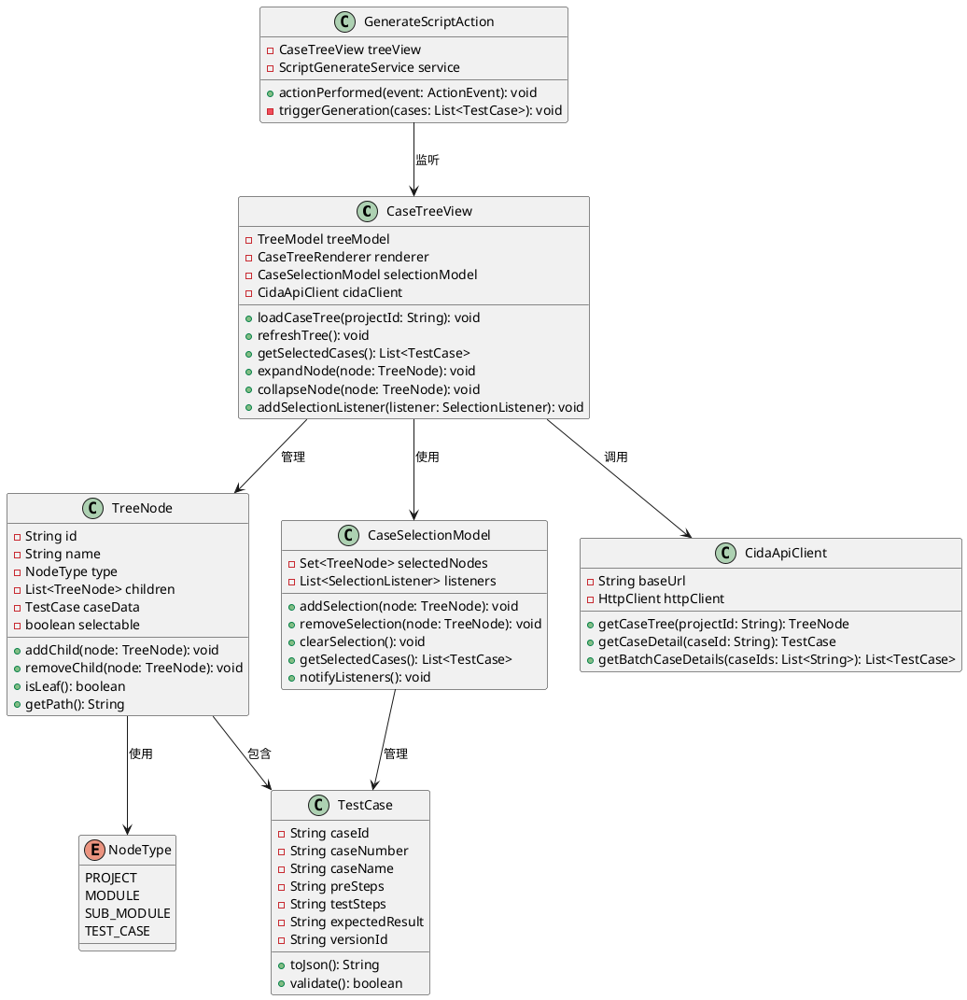

#### 用例加载序列图

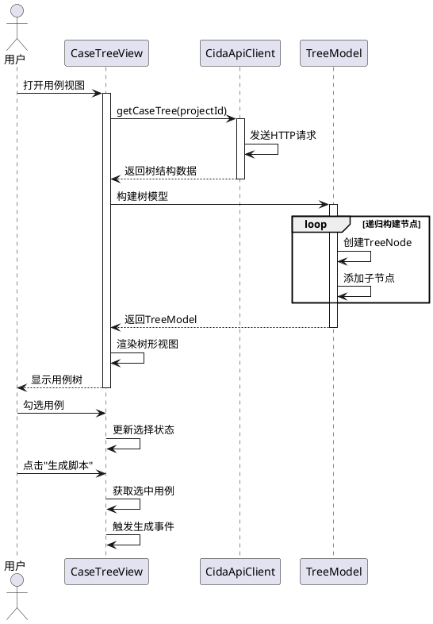

### 2.6 功能点5：TestMate插件Agent视图

#### 详细描述

**功能概述**：
在IDE右侧提供Agent视图（附屏页面），以流式方式展示脚本生成的整个过程，支持用户交互和审查。

**页面流程与布局**：

**阶段1：任务描述展示**
- 展示内容：脚本生成任务：用例编号列表
- 示例："脚本生成任务：TC001, TC002, TC003"

**阶段2：全局相似用例指定**
- 功能：提供文件选择组件
- 支持操作：用户可手工选择本地脚本文件
- 限制：最多选择5个全局相似用例
- 用途：这些全局相似用例将应用于所有待生成的脚本

**阶段3：批量生成启动**
- 展示：继续流程按钮
- 操作：用户点击后开始批量生成

**阶段4：逐个脚本生成展示**
- 对每个待生成的用例，依次展示生成过程：
  - 当前生成用例编号
  - 相似用例检索结果（最多5个）
  - 用户可手工调整相似用例选择
  - 脚本生成中状态提示
  - 生成完成后展示脚本预览
  - 提供"接受"和"拒绝"按钮

**阶段5：待审查文件列表**
- 位置：页面底部
- 功能：
  - 展示所有已生成待审查的脚本文件
  - 支持查看每个文件的diff
  - 支持单个接受/拒绝
  - 支持全部接受/全部拒绝
- 状态管理：生成中和生成完成后均可查看和操作

**页面状态流转**：
```
初始状态 → 任务描述 → 指定全局相似用例 → 批量生成中 → 生成完成 → 审查确认
```

#### Agent视图状态图

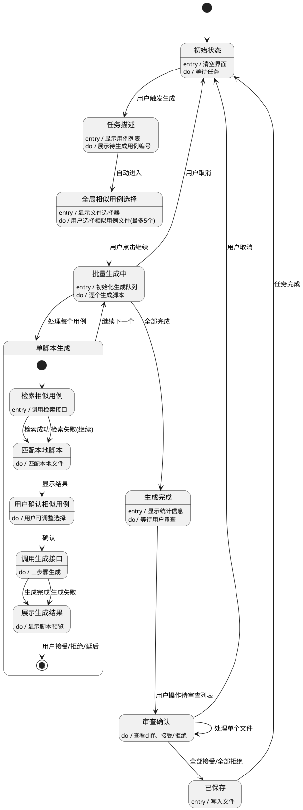

#### Agent视图类图

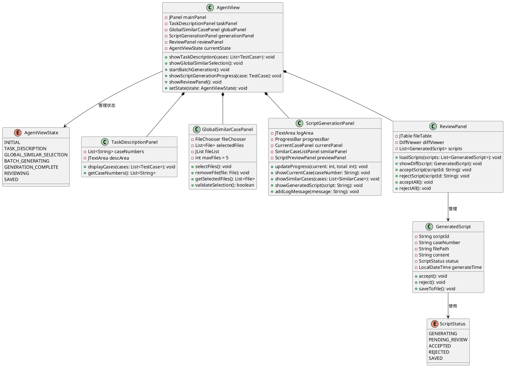

#### Agent视图界面结构图

```plantuml
@startuml
package "Agent视图布局" {
  
  rectangle "主面板(AgentView)" {
    rectangle "标题栏" {
      label "脚本生成助手"
      button "关闭"
    }
    
    rectangle "内容区域(可切换)" {
      
      rectangle "阶段1：任务描述面板" as stage1 {
        label "任务："
        rectangle "用例列表显示区" {
          label "TC001, TC002, TC003..."
        }
        button "下一步"
      }
      
      rectangle "阶段2：全局相似用例选择面板" as stage2 {
        button "选择文件(最多5个)"
        rectangle "已选文件列表" {
          label "file1.py [删除]"
          label "file2.py [删除]"
        }
        button "开始生成"
      }
      
      rectangle "阶段3&4：生成进度面板" as stage3 {
        rectangle "进度条" {
          label "3/10 已完成"
        }
        
        rectangle "当前用例区域" {
          label "正在生成: TC003"
          
          rectangle "相似用例列表" {
            label "TC002 (相似度: 0.89) [删除]"
            label "TC005 (相似度: 0.85) [删除]"
            button "添加相似用例"
          }
        }
        
        rectangle "生成日志" {
          label "检索相似用例..."
          label "匹配本地脚本..."
          label "调用生成接口..."
        }
        
        rectangle "脚本预览" {
          label "生成的脚本内容..."
          button "接受"
          button "拒绝"
          button "延后决定"
        }
      }
    }
    
    rectangle "底部：待审查文件列表" {
      rectangle "文件表格" {
        label "文件路径 | 用例编号 | 状态 | 操作"
        label "test_TC001.py | TC001 | 待审查 | [查看][接受][拒绝]"
        label "test_TC002.py | TC002 | 已接受 | [查看]"
      }
      
      button "全部接受"
      button "全部拒绝"
      button "查看选中diff"
    }
  }
}

note right of stage1
  用户触发生成后显示
end note

note right of stage2
  用户可选择全局相似用例
end note

note right of stage3
  逐个生成时实时更新
end note
@enduml
```

### 2.7 功能点6：相似用例匹配与选择

#### 详细描述

**功能概述**：
在生成每个脚本时，自动调用相似用例检索服务获取相似用例列表，并基于用例编号匹配本地脚本文件，最终形成相似脚本列表供生成使用。

**匹配流程**：
```
1. 调用TestAgent的相似用例检索接口
2. 获取相似用例列表（包含用例编号和相似度）
3. 基于用例编号与本地文件名匹配规则
4. 读取匹配到的本地脚本文件内容
5. 形成相似脚本列表（最多TOP5个）
6. 在IDE页面上呈现相似脚本列表
7. 若不足5个，支持用户手工新增选择
```

**匹配规则**：
- 文件名规则：用例编号作为文件名或文件名的一部分
- 示例：TC001 → TC001.py 或 test_TC001.py
- 优先级：完全匹配 > 部分匹配

**相似脚本展示**：
- 展示信息：用例编号、文件名、相似度、脚本摘要
- 支持操作：删除、新增、查看完整脚本

**数据结构**：
```
相似脚本项
├── 用例编号
├── 本地文件路径
├── 相似度得分
├── 脚本内容
└── 是否手工添加
```

#### 相似用例匹配流程图

```plantuml
@startuml
start

:接收待生成用例信息;

:调用相似用例检索接口;

if (检索成功?) then (是)
  :获取相似用例列表;
  :提取用例编号列表;
else (否)
  :记录检索失败;
  :相似用例列表为空;
endif

:初始化匹配结果列表;

partition 本地文件匹配 {
  :获取项目本地脚本文件列表;
  
  fork
    :完全匹配规则;
    note right
      文件名 == 用例编号
      例如: TC001.py
    end note
  fork again
    :部分匹配规则;
    note right
      文件名包含用例编号
      例如: test_TC001.py
    end note
  end fork
  
  :遍历相似用例列表;
  
  loop 对每个相似用例
    if (本地存在匹配文件?) then (是)
      :读取脚本文件内容;
      :添加到匹配结果;
      note right
        记录: 用例编号、文件路径
        相似度、脚本内容
      end note
    else (否)
      :跳过该用例;
    endif
  end loop
}

:合并全局相似用例;
note right
  将用户手工选择的
  全局相似用例添加到列表
end note

:按相似度降序排序;

:取TOP 5个相似脚本;

if (结果数量 < 5?) then (是)
  :在UI显示"可手工添加";
  :用户可选择补充脚本;
else (否)
  :结果已满足需求;
endif

:返回最终相似脚本列表;

stop
@enduml
```

#### 相似用例匹配序列图

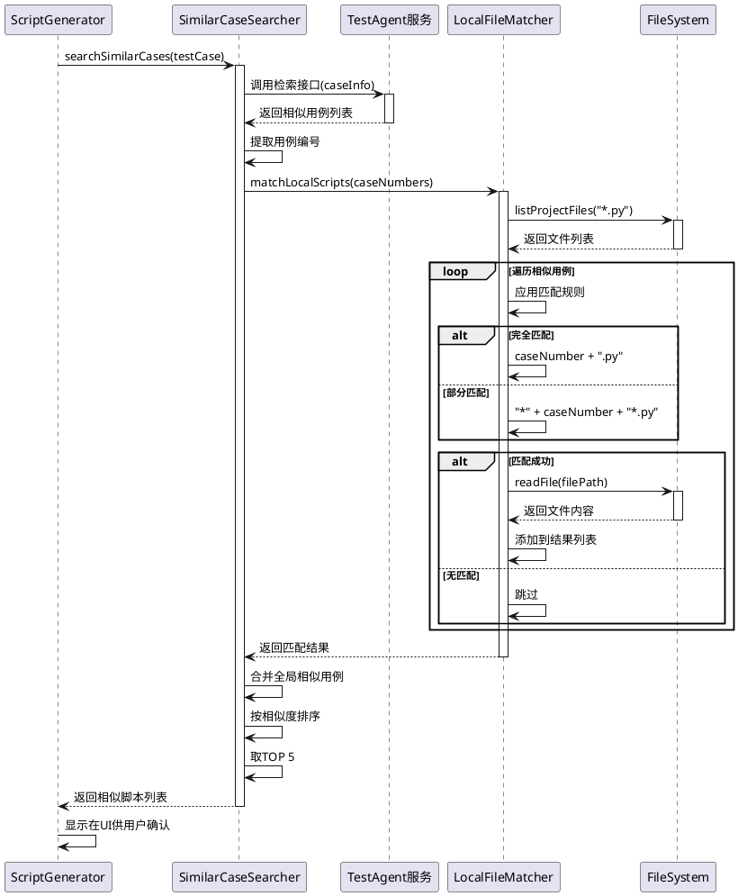

#### 数据对象类图

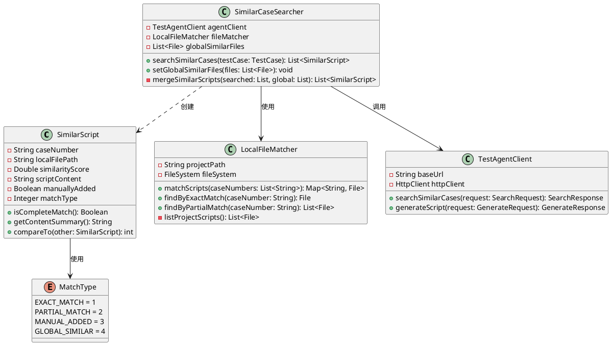

### 2.8 功能点7：全脚本生成引擎

#### 详细描述

**功能概述**：
在TestAgent服务中提供脚本生成接口，接收待生成脚本信息和相似脚本内容，通过三步骤生成流程完成高质量脚本生成。

**生成流程（三步骤）**：

**步骤1：基于相似用例生成初版脚本**
- 输入：
  - 待生成脚本的用例信息（用例名称、编号、步骤、预期结果）
  - 相似脚本内容列表
- Prompt构建：使用"基于相似用例生成脚本"的Prompt模板
- 模型调用：调用用户从IDE页面选中的大模型
- 输出：初版生成脚本

**步骤2：相似步骤检索**
- 输入：待生成用例的测试步骤列表
- 处理：提取每个测试步骤
- 检索：对每个步骤进行相似步骤检索，获取TOP3相似步骤及其代码实现
- 输出：步骤级相似代码映射表

**步骤3：基于相似步骤优化脚本**
- 输入：
  - 步骤1生成的初版脚本
  - 步骤2的步骤级相似代码映射表
- Prompt构建：使用"基于相似步骤优化脚本"的Prompt模板
- 模型调用：调用用户从IDE页面选中的大模型
- 输出：最终优化后的脚本

**接口定义**：
- 接口名称：全脚本生成接口
- 请求参数：
  - 待生成脚本信息（用例对象）
  - 相似脚本内容列表
  - 模型配置（模型类型、参数）
- 响应结果：
  - 生成状态
  - 最终脚本内容
  - 生成过程信息（可选）

**质量保障策略**：
- 两阶段生成：先整体后细节
- 相似性引导：基于历史高质量脚本
- 步骤级对齐：确保每个步骤都有实现依据

#### 三步骤生成流程图

```plantuml
@startuml
!define RECTANGLE class

start

:接收生成请求;
note right
  包含:
  - 用例信息
  - 相似脚本列表
  - 模型配置
end note

partition "步骤1: 基于相似用例生成初版脚本" {
  :提取用例信息;
  note right
    - 用例名称
    - 用例编号
    - 预制步骤
    - 测试步骤
    - 预期结果
  end note
  
  :读取相似脚本内容;
  
  :构建Prompt-v1;
  note right
    Prompt模板包含:
    1. 任务描述
    2. 用例详细信息
    3. 相似脚本示例
    4. 生成要求
  end note
  
  :调用大模型生成;
  
  if (生成成功?) then (是)
    :获取初版脚本;
  else (否)
    :重试(最多3次);
    if (重试成功?) then (是)
      :获取初版脚本;
    else (否)
      :返回生成失败;
      stop
    endif
  endif
}

partition "步骤2: 相似步骤检索" {
  :从用例中提取测试步骤列表;
  
  :初始化步骤映射表;
  
  loop 对每个测试步骤
    :调用步骤级检索接口;
    note right
      检索该步骤的
      TOP3相似步骤实现
    end note
    
    :获取相似步骤及代码;
    
    :添加到映射表;
    note right
      步骤描述 -> [相似代码1, 相似代码2, 相似代码3]
    end note
  end loop
  
  :返回步骤级代码映射表;
}

partition "步骤3: 基于相似步骤优化脚本" {
  :获取步骤1的初版脚本;
  
  :获取步骤2的代码映射表;
  
  :构建Prompt-v2;
  note right
    Prompt模板包含:
    1. 优化任务描述
    2. 初版脚本
    3. 步骤级代码参考
    4. 优化要求
  end note
  
  :调用大模型优化;
  
  if (优化成功?) then (是)
    :获取最终脚本;
  else (否)
    :重试(最多3次);
    if (重试成功?) then (是)
      :获取最终脚本;
    else (否)
      :使用初版脚本作为最终结果;
    endif
  endif
}

:后处理;
note right
  - 格式化代码
  - 添加注释
  - 验证语法
end note

:返回最终脚本;

stop
@enduml
```

#### 全脚本生成序列图

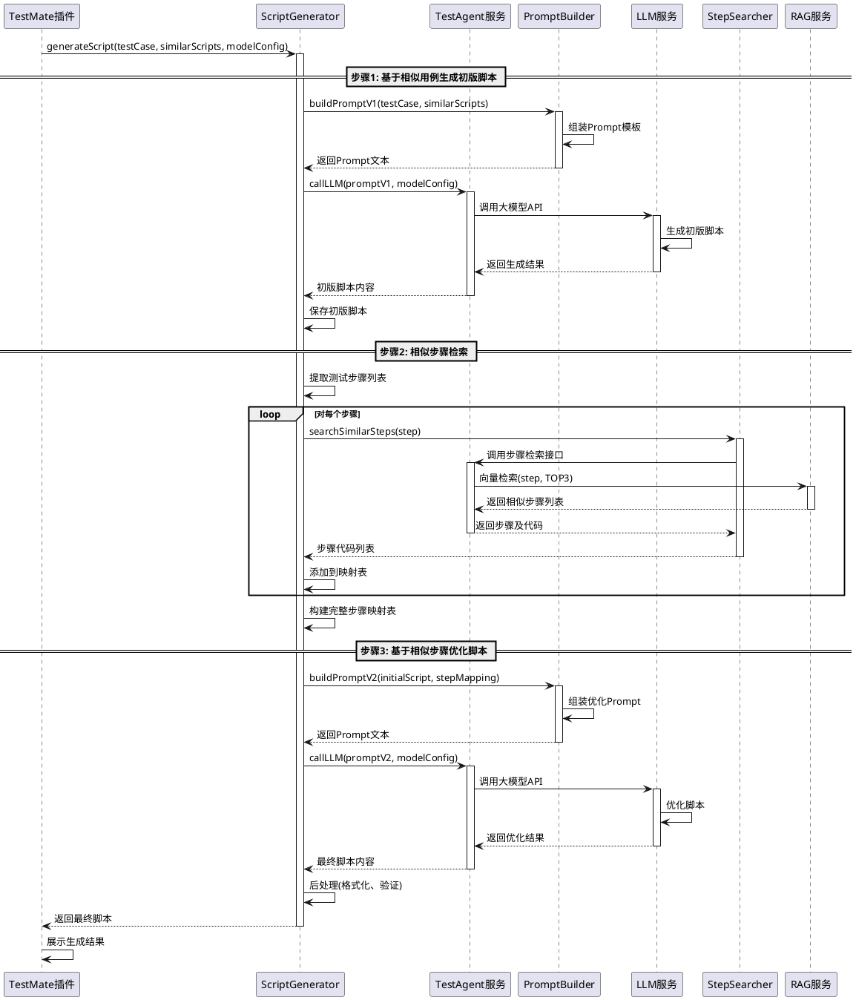

#### 脚本生成接口定义

**接口：全脚本生成接口**

```
接口名称: generateFullScript
请求方式: POST
路径: /api/v1/script/generate

请求参数 (ScriptGenerateRequest):
{
  "testCase": {                            // 测试用例对象, 必填
    "caseNumber": "TC001",
    "caseName": "用户登录功能测试",
    "preSteps": "1. 打开浏览器\n2. 访问登录页面",
    "testSteps": "1. 输入用户名\n2. 输入密码\n3. 点击登录按钮",
    "expectedResult": "登录成功，跳转到首页"
  },
  "similarScripts": [                      // 相似脚本列表, 可选
    {
      "caseNumber": "TC002",
      "filePath": "/path/to/test_TC002.py",
      "scriptContent": "def test_admin_login():..."
    }
  ],
  "modelConfig": {                         // 模型配置, 必填
    "modelType": "GPT4",                   // 模型类型
    "temperature": 0.7,                    // 温度参数
    "maxTokens": 2000                      // 最大Token数
  },
  "includeStepSearch": true,               // 是否启用步骤检索, 默认true
  "returnIntermediateResults": false       // 是否返回中间结果, 默认false
}

响应结果 (ScriptGenerateResponse):
{
  "code": 200,
  "message": "success",
  "data": {
    "scriptId": "script_20250115_001",     // 脚本ID
    "caseNumber": "TC001",
    "finalScript": "def test_user_login():...",  // 最终脚本
    "generateTime": 25.6,                  // 生成耗时(秒)
    "intermediateResults": {               // 中间结果(可选)
      "initialScript": "...",              // 初版脚本
      "stepMapping": {...},                // 步骤映射表
      "optimizedScript": "..."             // 优化后脚本
    },
    "metadata": {
      "modelUsed": "GPT4",
      "tokenUsage": {
        "prompt": 1500,
        "completion": 800,
        "total": 2300
      },
      "stepCount": 3,
      "similarScriptCount": 2
    }
  }
}

异常响应:
{
  "code": 500,
  "message": "LLM调用失败: 超时",
  "data": {
    "errorType": "LLM_TIMEOUT",
    "retryCount": 3,
    "lastError": "Request timeout after 30s"
  }
}
```

#### 生成引擎类图

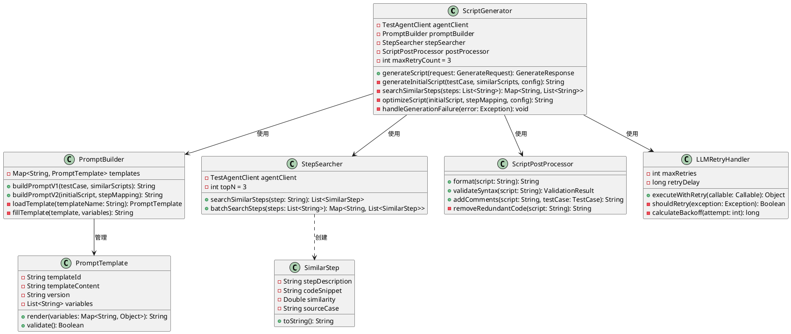

### 2.9 功能点8：脚本审查与管理

#### 详细描述

**功能概述**：
在Agent视图中提供完整的脚本审查和管理功能，支持用户对生成的脚本进行查看、对比、接受或拒绝操作。

**审查功能**：

**1. 单个脚本审查**
- 时机：每个脚本生成完成后立即展示
- 展示内容：
  - 生成的脚本代码预览
  - 关键信息摘要
- 操作选项：
  - 接受：将脚本写入对应文件
  - 拒绝：不保存该脚本
  - 延后决定：加入待审查列表

**2. 文件Diff查看**
- 功能：对比生成脚本与现有文件的差异
- 展示方式：侧边对比视图（旧版本 vs 新版本）
- 支持操作：
  - 按行高亮差异
  - 支持滚动同步

**3. 待审查文件列表**
- 位置：附屏页面底部
- 展示内容：
  - 文件路径
  - 用例编号
  - 生成状态（生成中/已生成）
  - 审查状态（待审查/已接受/已拒绝）
- 操作功能：
  - 单击文件：查看diff
  - 单个接受：保存该文件
  - 单个拒绝：删除生成结果
  - 全部接受：保存所有已生成文件
  - 全部拒绝：删除所有生成结果

**文件管理策略**：
- 临时存储：生成的脚本先保存到临时目录
- 确认写入：用户接受后才写入正式目录
- 冲突处理：若文件已存在，提供覆盖/合并选项

**状态管理**：
```
脚本审查状态机
├── 生成中
├── 待审查
├── 已接受
├── 已拒绝
└── 已保存
```

#### 脚本审查状态图

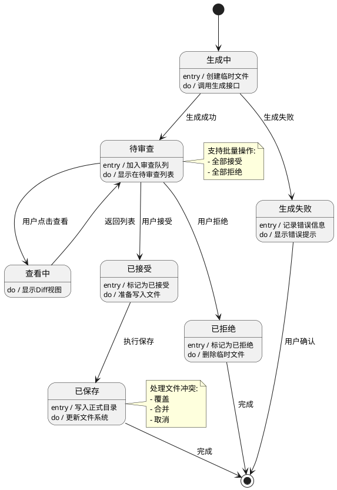

#### 审查管理类图

```plantuml
@startuml
class ReviewManager {
  - List<GeneratedScript> pendingScripts
  - List<GeneratedScript> acceptedScripts
  - List<GeneratedScript> rejectedScripts
  - DiffCalculator diffCalculator
  - FileWriter fileWriter
  
  + addScript(script: GeneratedScript): void
  + getScript(scriptId: String): GeneratedScript
  + acceptScript(scriptId: String): void
  + rejectScript(scriptId: String): void
  + acceptAll(): void
  + rejectAll(): void
  + saveAcceptedScripts(): SaveResult
  + getPendingCount(): int
}

class GeneratedScript {
  - String scriptId
  - String caseNumber
  - String caseName
  - String filePath
  - String content
  - ScriptStatus status
  - LocalDateTime generateTime
  - String errorMessage
  
  + accept(): void
  + reject(): void
  + isPending(): boolean
  + isAccepted(): boolean
  + toFile(): File
}

enum ScriptStatus {
  GENERATING
  PENDING_REVIEW
  ACCEPTED
  REJECTED
  SAVED
  GENERATION_FAILED
  
  + isTerminal(): boolean
  + canTransitionTo(target: ScriptStatus): boolean
}

class DiffCalculator {
  - DiffAlgorithm algorithm
  
  + calculateDiff(oldContent: String, newContent: String): DiffResult
  + generateDiffView(diff: DiffResult): String
  - highlightChanges(lines: List<String>): List<HighlightedLine>
}

class DiffResult {
  - List<DiffLine> lines
  - int addedLines
  - int deletedLines
  - int changedLines
  
  + getAddedLines(): List<DiffLine>
  + getDeletedLines(): List<DiffLine>
  + getChangedLines(): List<DiffLine>
  + isEmpty(): boolean
}

class DiffLine {
  - int lineNumber
  - String content
  - DiffType type
  
  + isAdded(): boolean
  + isDeleted(): boolean
  + isUnchanged(): boolean
}

enum DiffType {
  ADDED
  DELETED
  CHANGED
  UNCHANGED
}

class FileWriter {
  - String projectPath
  - FileConflictResolver conflictResolver
  
  + writeScript(script: GeneratedScript): WriteResult
  + batchWrite(scripts: List<GeneratedScript>): BatchWriteResult
  - checkFileExists(filePath: String): boolean
  - handleConflict(filePath: String, content: String): void
}

class FileConflictResolver {
  + resolve(existingFile: File, newContent: String): ConflictResolution
  + showConflictDialog(file: File): UserChoice
}

enum ConflictResolution {
  OVERWRITE
  MERGE
  SKIP
  RENAME
}

class ReviewPanel {
  - ReviewManager reviewManager
  - DiffViewer diffViewer
  - JTable scriptTable
  - ScriptTableModel tableModel
  
  + refreshTable(): void
  + showDiff(scriptId: String): void
  + acceptSelected(): void
  + rejectSelected(): void
  + acceptAll(): void
  + rejectAll(): void
}

class DiffViewer {
  - JTextPane leftPane
  - JTextPane rightPane
  - DiffResult currentDiff
  
  + showDiff(diff: DiffResult): void
  + highlightLine(lineNumber: int): void
  + syncScroll(): void
  - renderLine(line: DiffLine): void
}

ReviewManager --> GeneratedScript : 管理
ReviewManager --> DiffCalculator : 使用
ReviewManager --> FileWriter : 使用
GeneratedScript --> ScriptStatus : 使用
DiffCalculator ..> DiffResult : 创建
DiffResult *-- DiffLine : 包含
DiffLine --> DiffType : 使用
FileWriter --> FileConflictResolver : 使用
FileConflictResolver ..> ConflictResolution : 返回
ReviewPanel --> ReviewManager : 使用
ReviewPanel *-- DiffViewer : 包含
@enduml
```

#### 脚本审查序列图

```plantuml
@startuml
actor 用户
participant "ReviewPanel" as panel
participant "ReviewManager" as manager
participant "DiffCalculator" as diff
participant "DiffViewer" as viewer
participant "FileWriter" as writer
participant "FileSystem" as fs

== 查看Diff ==

用户 -> panel: 点击查看脚本
activate panel

panel -> manager: getScript(scriptId)
activate manager
manager --> panel: 返回GeneratedScript
deactivate manager

panel -> fs: readExistingFile(filePath)
activate fs
alt 文件存在
  fs --> panel: 返回现有内容
else 文件不存在
  fs --> panel: 返回空内容
end
deactivate fs

panel -> diff: calculateDiff(oldContent, newContent)
activate diff
diff -> diff: 执行Diff算法
diff --> panel: 返回DiffResult
deactivate diff

panel -> viewer: showDiff(diffResult)
activate viewer
viewer -> viewer: 渲染左右对比视图
viewer -> viewer: 高亮差异行
viewer --> panel: 显示完成
deactivate viewer

panel --> 用户: 展示Diff视图
deactivate panel

== 接受脚本 ==

用户 -> panel: 点击接受
activate panel

panel -> manager: acceptScript(scriptId)
activate manager
manager -> manager: 更新状态为ACCEPTED
manager --> panel: 接受成功
deactivate manager

panel -> panel: 更新表格显示
panel --> 用户: 显示已接受
deactivate panel

== 保存所有已接受的脚本 ==

用户 -> panel: 点击全部保存
activate panel

panel -> manager: saveAcceptedScripts()
activate manager

loop 遍历已接受脚本
  manager -> writer: writeScript(script)
  activate writer
  
  writer -> fs: checkFileExists(filePath)
  activate fs
  fs --> writer: 返回是否存在
  deactivate fs
  
  alt 文件已存在
    writer -> writer: handleConflict()
    note right
      根据用户选择:
      - 覆盖
      - 合并
      - 跳过
    end note
  end
  
  writer -> fs: writeFile(filePath, content)
  activate fs
  fs --> writer: 写入成功
  deactivate fs
  
  writer --> manager: 写入结果
  deactivate writer
  
  manager -> manager: 更新状态为SAVED
end

manager --> panel: 返回保存结果统计
deactivate manager

panel -> panel: 显示成功/失败统计
panel --> 用户: 完成提示
deactivate panel

@enduml
```

#### 审查数据库表设计

**表5：script_generation_record（脚本生成记录表）**

| 字段名 | 类型 | 约束 | 说明 |
|--------|------|------|------|
| record_id | BIGINT | PRIMARY KEY | 记录ID |
| script_id | VARCHAR(100) | NOT NULL, UNIQUE | 脚本ID |
| case_number | VARCHAR(100) | NOT NULL | 用例编号 |
| case_name | VARCHAR(500) | NOT NULL | 用例名称 |
| file_path | VARCHAR(500) | NOT NULL | 文件路径 |
| script_content | TEXT | NOT NULL | 脚本内容 |
| status | VARCHAR(50) | NOT NULL | 状态 |
| generate_time | DATETIME | NOT NULL | 生成时间 |
| review_time | DATETIME | NULL | 审查时间 |
| save_time | DATETIME | NULL | 保存时间 |
| error_message | TEXT | NULL | 错误信息 |
| user_id | VARCHAR(100) | NOT NULL | 用户ID |

## 3 DFX分析

### 3.1 可靠性设计

**1. 异常处理**
- RAG服务调用失败：提供降级方案，允许用户手工选择相似用例
- 大模型调用失败：支持重试机制，最多重试3次
- 网络超时：设置合理的超时时间（30秒），超时后提示用户

**2. 数据一致性**
- 用例版本管理：确保检索配置与用例版本强关联
- 脚本生成状态：实时同步生成状态，避免状态不一致

**3. 容错机制**
- 部分失败继续：批量生成时，单个失败不影响其他脚本生成
- 断点续传：支持中断后从上次位置继续生成

### 3.2 性能设计

**1. 响应时间优化**
- 相似用例检索：目标响应时间 < 2秒
- 单个脚本生成：目标响应时间 < 30秒
- 批量生成：支持并发处理，最大并发数为3

**2. 资源管理**
- 缓存策略：相似用例检索结果缓存5分钟
- 连接池：RAG服务和大模型调用使用连接池
- 内存管理：大文件读取采用流式处理

**3. 并发控制**
- 请求限流：防止大量并发请求冲击后端服务
- 队列管理：生成任务进入队列，顺序或并发处理

### 3.3 安全性设计

**1. 数据安全**
- 敏感信息脱敏：用例中的敏感数据在入库前进行脱敏
- 访问控制：检索服务需要鉴权，确保用户只能访问有权限的用例版本
- 数据传输：使用HTTPS加密传输

**2. 代码安全**
- 生成脚本审查：提醒用户审查生成的脚本，避免恶意代码
- 文件写入权限：验证文件写入路径的合法性

### 3.4 易用性设计

**1. 用户体验**
- 进度反馈：生成过程实时展示进度和状态
- 操作引导：首次使用提供操作引导
- 错误提示：友好的错误提示信息

**2. 灵活性**
- 配置可调：检索参数和生成策略支持灵活配置
- 人工介入：关键节点支持人工调整和干预
- 模型可选：支持用户选择不同的大模型

### 3.5 可维护性设计

**1. 日志记录**
- 操作日志：记录用户的关键操作
- 调用日志：记录服务间调用的详细信息
- 错误日志：记录异常和错误堆栈

**2. 监控告警**
- 接口监控：监控各服务接口的调用量和成功率
- 性能监控：监控响应时间和资源使用情况
- 异常告警：关键异常实时告警

**3. 版本管理**
- Prompt版本：Prompt模板支持版本管理
- 配置版本：检索配置支持版本回滚
- 接口版本：服务接口支持多版本并存

## 4 测试分析

### 4.1 功能测试

**测试场景1：用例入库功能**
- 测试方法：选择单个版本入库，验证RAG库中数据正确性
- 预期结果：用例数据完整入库，返回成功状态

**测试场景2：检索配置管理**
- 测试方法：配置不同的检索参数组合，验证配置保存和读取
- 预期结果：配置正确保存并与版本关联，读取时返回正确配置

**测试场景3：相似用例检索**
- 测试方法：输入测试用例，调用检索接口，验证返回结果
- 预期结果：返回TOP-N个相似用例，相似度排序正确，步骤覆盖度计算准确

**测试场景4：用例视图展示**
- 测试方法：打开用例视图，验证用例树结构和勾选功能
- 预期结果：用例树正确展示，勾选和触发生成功能正常

**测试场景5：全局相似用例选择**
- 测试方法：手工选择多个本地脚本文件作为全局相似用例
- 预期结果：最多允许选择5个，文件内容正确读取

**测试场景6：单个脚本生成**
- 测试方法：选择单个用例触发生成，验证完整生成流程
- 预期结果：
  - 相似用例检索成功
  - 相似脚本匹配正确
  - 三步骤生成流程正常执行
  - 生成的脚本在Agent视图正确展示

**测试场景7：批量脚本生成**
- 测试方法：选择多个用例（5-10个）批量生成
- 预期结果：
  - 所有用例依次生成
  - 生成进度实时更新
  - 部分失败不影响其他用例

**测试场景8：脚本审查与保存**
- 测试方法：在待审查列表中操作单个接受/拒绝和批量接受/拒绝
- 预期结果：
  - Diff正确展示
  - 接受后文件正确写入
  - 拒绝后文件不保存

### 4.2 性能测试

**测试场景9：相似用例检索性能**
- 测试方法：并发调用检索接口100次
- 预期结果：平均响应时间 < 2秒，成功率 > 99%

**测试场景10：批量生成性能**
- 测试方法：批量生成50个脚本，记录总耗时
- 预期结果：单个脚本平均生成时间 < 30秒

**测试场景11：大用例树加载性能**
- 测试方法：加载包含1000个用例的用例树
- 预期结果：加载时间 < 5秒，树形展示流畅

### 4.3 兼容性测试

**测试场景12：多IDE环境兼容**
- 测试方法：在PyCharm不同版本中测试插件功能
- 预期结果：插件在主流版本中正常运行

**测试场景13：多大模型兼容**
- 测试方法：切换不同的大模型（GPT、Claude、国产模型）进行脚本生成
- 预期结果：各模型均能正常调用并生成脚本

### 4.4 异常测试

**测试场景14：网络异常处理**
- 测试方法：模拟网络中断，测试各服务调用的异常处理
- 预期结果：超时后有明确提示，支持重试

**测试场景15：大模型调用失败**
- 测试方法：模拟大模型服务不可用
- 预期结果：失败后自动重试，达到重试上限后给出明确提示

**测试场景16：相似用例检索为空**
- 测试方法：输入完全新颖的用例，检索不到相似用例
- 预期结果：允许用户手工选择相似用例或跳过相似用例直接生成

**测试场景17：本地脚本文件不存在**
- 测试方法：检索到的用例编号在本地无对应脚本文件
- 预期结果：相似脚本列表为空，支持用户手工添加

### 4.5 安全测试

**测试场景18：权限验证**
- 测试方法：使用无权限用户访问其他版本的用例
- 预期结果：返回权限不足提示，拒绝访问

**测试场景19：文件路径安全**
- 测试方法：尝试写入非法路径（如系统目录）
- 预期结果：路径验证失败，拒绝写入

### 4.6 用户体验测试

**测试场景20：操作流畅性**
- 测试方法：完整走通从用例选择到脚本保存的全流程
- 预期结果：操作流畅，无卡顿，提示信息清晰

**测试场景21：中断后恢复**
- 测试方法：批量生成过程中关闭插件，重新打开
- 预期结果：能够查看已生成的脚本，支持继续未完成的任务

